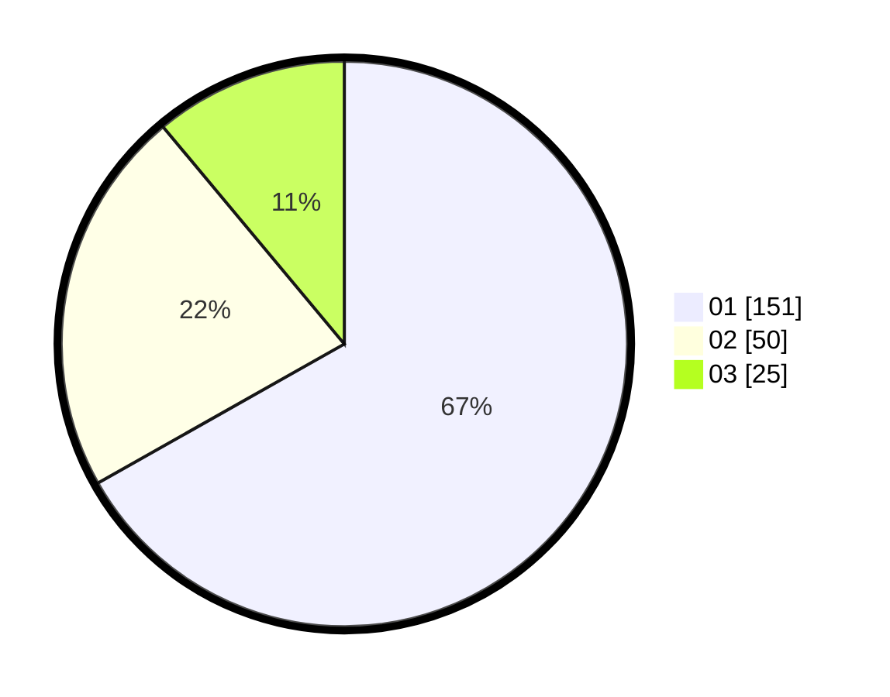

# Hasil

Hasil perolehan suara paslon dapat dilihat pada file paslon-01.txt, paslon-02.txt, dan paslon-03.txt.

Jika tidak ada, artinya data tersebut belum ada pada SIREKAP.

## Perolehan Suara

 * Paslon 01: **151**.
 * Paslon 02: **50**.
 * Paslon 03: **25**.

## Foto C Plano

https://sirekap-obj-formc.kpu.go.id/6332/pemilu/ppwp/31/75/03/10/06/3175031006106-20240214-212454--4a7579b4-f0d5-44aa-acf1-9139e78d5715.jpg

https://sirekap-obj-formc.kpu.go.id/6332/pemilu/ppwp/31/75/03/10/06/3175031006106-20240214-212559--dca4d99c-9b2b-4c08-a7c5-84ea2d49014f.jpg

https://sirekap-obj-formc.kpu.go.id/6332/pemilu/ppwp/31/75/03/10/06/3175031006106-20240214-212646--3ae1185a-a725-42ee-9924-f0099cfcf738.jpg

## DATA PEMILIH TETAP

Jumlah pemilih dalam DPT: **293**.
 * L: **146**.
 * P: **147**.

## DATA PENGGUNA HAK PILIH

Jumlah pengguna hak pilih dalam DPT: **234**.
 * L: **110**.
 * P: **124**.

Jumlah pengguna hak pilih dalam DPTb: **4**.
 * L: **2**.
 * P: **2**.

Jumlah pengguna hak pilih dalam DPK: **2**.
 * L: **0**.
 * P: **2**.

Jumlah pengguna hak pilih: **240**.
 * L: **112**.
 * P: **128**.

## JUMLAH SUARA SAH DAN TIDAK SAH

JUMLAH SELURUH SUARA SAH: **227**.

JUMLAH SUARA TIDAK SAH: **3**.

JUMLAH SELURUH SUARA SAH DAN SUARA TIDAK SAH: **230**.
