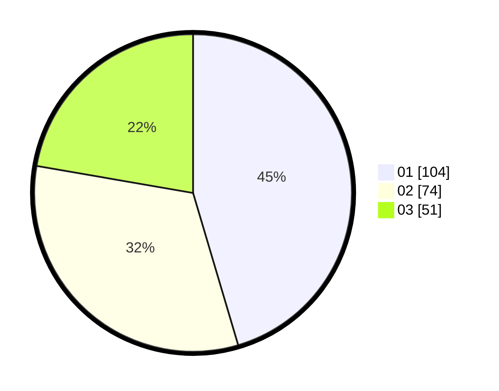

# Hasil

Hasil perolehan suara paslon dapat dilihat pada file paslon-01.txt, paslon-02.txt, dan paslon-03.txt.

Jika tidak ada, artinya data tersebut belum ada pada SIREKAP.

## Perolehan Suara

 * Paslon 01: **104**.
 * Paslon 02: **74**.
 * Paslon 03: **51**.

## Foto C Plano

https://sirekap-obj-formc.kpu.go.id/3fee/pemilu/ppwp/31/75/03/10/06/3175031006109-20240215-002111--21a10a7b-7dff-4ee2-87a4-a07a1a86344a.jpg

https://sirekap-obj-formc.kpu.go.id/3fee/pemilu/ppwp/31/75/03/10/06/3175031006109-20240215-002227--3e74f532-63db-49c8-bf2a-140ae3d76eb7.jpg
