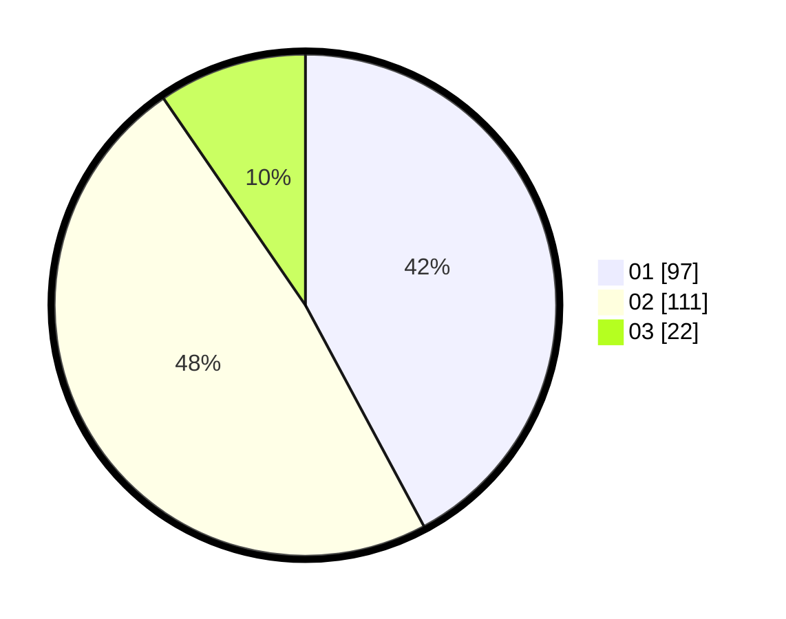

# Hasil

Hasil perolehan suara paslon dapat dilihat pada file paslon-01.txt, paslon-02.txt, dan paslon-03.txt.

Jika tidak ada, artinya data tersebut belum ada pada SIREKAP.

## Perolehan Suara

 * Paslon 01: **97**.
 * Paslon 02: **111**.
 * Paslon 03: **22**.

## Foto C Plano

https://sirekap-obj-formc.kpu.go.id/0733/pemilu/ppwp/31/75/03/10/06/3175031006111-20240215-015431--757da10f-35a9-42b5-8e22-ba798ad715cd.jpg

https://sirekap-obj-formc.kpu.go.id/0733/pemilu/ppwp/31/75/03/10/06/3175031006111-20240215-015632--4bb0a9a6-ddfd-48f5-98d7-1702382fc13c.jpg

https://sirekap-obj-formc.kpu.go.id/0733/pemilu/ppwp/31/75/03/10/06/3175031006111-20240215-015746--4c41e8bf-1248-471c-a335-3a3fc5cee3c7.jpg
