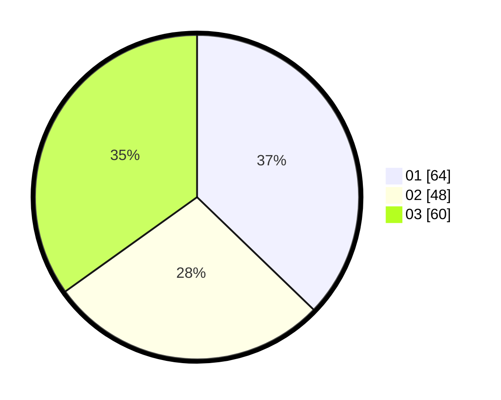

# Hasil

Hasil perolehan suara paslon dapat dilihat pada file paslon-01.txt, paslon-02.txt, dan paslon-03.txt.

Jika tidak ada, artinya data tersebut belum ada pada SIREKAP.

## Perolehan Suara

 * Paslon 01: **64**.
 * Paslon 02: **48**.
 * Paslon 03: **60**.

## Foto C Plano

https://sirekap-obj-formc.kpu.go.id/f43a/pemilu/ppwp/31/75/03/10/06/3175031006114-20240214-155426--ab43feee-0af8-4404-8453-4b2eb2a533e8.jpg

https://sirekap-obj-formc.kpu.go.id/f43a/pemilu/ppwp/31/75/03/10/06/3175031006114-20240214-160129--571a1933-3f6b-4e63-9416-25940d91337a.jpg

https://sirekap-obj-formc.kpu.go.id/f43a/pemilu/ppwp/31/75/03/10/06/3175031006114-20240214-203700--9ba0330b-b85f-48bc-abb2-a0e50dd7a19e.jpg

## DATA PEMILIH TETAP

Jumlah pemilih dalam DPT: **227**.
 * L: **104**.
 * P: **123**.

## DATA PENGGUNA HAK PILIH

Jumlah pengguna hak pilih dalam DPT: **171**.
 * L: **80**.
 * P: **91**.

Jumlah pengguna hak pilih dalam DPTb: **4**.
 * L: **2**.
 * P: **2**.

Jumlah pengguna hak pilih dalam DPK: **1**.
 * L: **0**.
 * P: **1**.

Jumlah pengguna hak pilih: **176**.
 * L: **82**.
 * P: **94**.

## JUMLAH SUARA SAH DAN TIDAK SAH

JUMLAH SELURUH SUARA SAH: **172**.

JUMLAH SUARA TIDAK SAH: **4**.

JUMLAH SELURUH SUARA SAH DAN SUARA TIDAK SAH: **176**.
