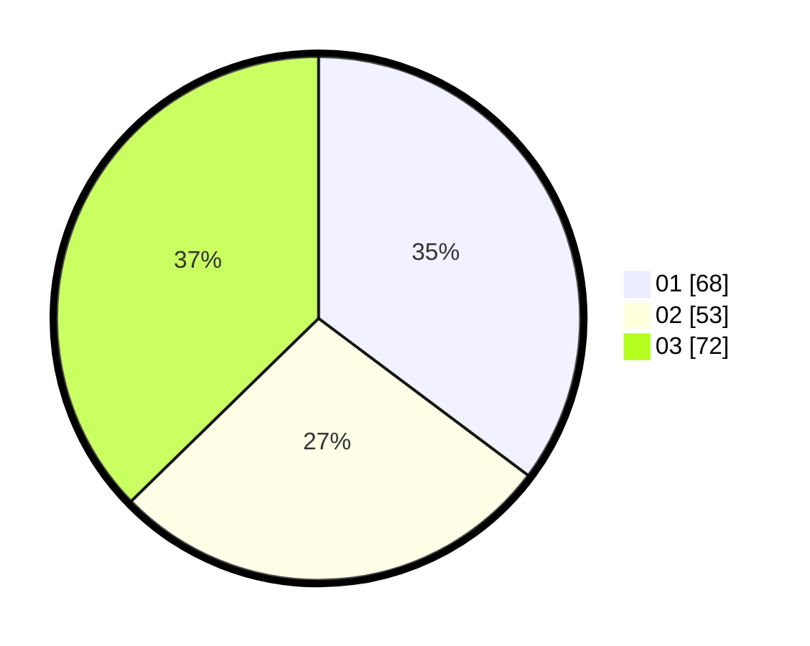

# Hasil

Hasil perolehan suara paslon dapat dilihat pada file paslon-01.txt, paslon-02.txt, dan paslon-03.txt.

Jika tidak ada, artinya data tersebut belum ada pada SIREKAP.

## Perolehan Suara

 * Paslon 01: **68**.
 * Paslon 02: **53**.
 * Paslon 03: **72**.

## Foto C Plano

https://sirekap-obj-formc.kpu.go.id/db11/pemilu/ppwp/31/75/03/10/06/3175031006116-20240214-212532--99e07f0e-8008-42fb-85d8-71b63d42fa84.jpg

https://sirekap-obj-formc.kpu.go.id/db11/pemilu/ppwp/31/75/03/10/06/3175031006116-20240214-212756--918b73e4-6d37-4ebf-9bd7-87240dabb95d.jpg

https://sirekap-obj-formc.kpu.go.id/db11/pemilu/ppwp/31/75/03/10/06/3175031006116-20240214-212922--eb6706ab-23ba-456e-950d-4ae63e19fec6.jpg

## DATA PEMILIH TETAP

Jumlah pemilih dalam DPT: **230**.
 * L: **111**.
 * P: **119**.

## DATA PENGGUNA HAK PILIH

Jumlah pengguna hak pilih dalam DPT: **188**.
 * L: **88**.
 * P: **100**.

Jumlah pengguna hak pilih dalam DPTb: **0**.
 * L: **0**.
 * P: **0**.

Jumlah pengguna hak pilih dalam DPK: **8**.
 * L: **3**.
 * P: **5**.

Jumlah pengguna hak pilih: **196**.
 * L: **91**.
 * P: **105**.

## JUMLAH SUARA SAH DAN TIDAK SAH

JUMLAH SELURUH SUARA SAH: **193**.

JUMLAH SUARA TIDAK SAH: **3**.

JUMLAH SELURUH SUARA SAH DAN SUARA TIDAK SAH: **196**.
