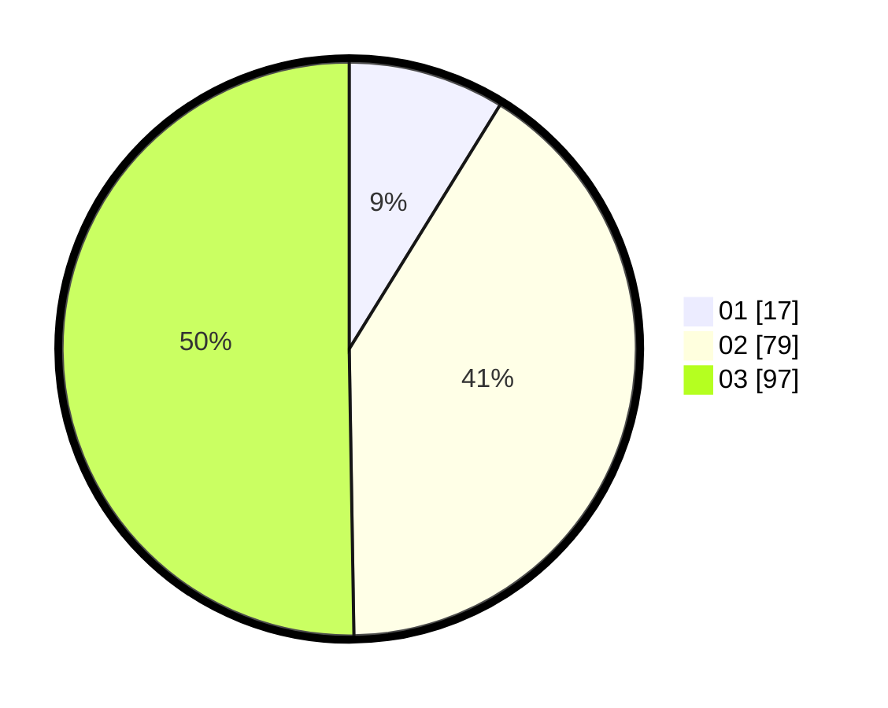

# Hasil

Hasil perolehan suara paslon dapat dilihat pada file paslon-01.txt, paslon-02.txt, dan paslon-03.txt.

Jika tidak ada, artinya data tersebut belum ada pada SIREKAP.

## Perolehan Suara

 * Paslon 01: **17**.
 * Paslon 02: **79**.
 * Paslon 03: **97**.

## Foto C Plano

https://sirekap-obj-formc.kpu.go.id/7d03/pemilu/ppwp/31/75/03/10/06/3175031006118-20240214-201507--406075d7-ecf5-4146-99a3-512bffe050c5.jpg

https://sirekap-obj-formc.kpu.go.id/7d03/pemilu/ppwp/31/75/03/10/06/3175031006118-20240214-202209--6db56bc4-ee78-49a3-904f-307a1c1e30d9.jpg

https://sirekap-obj-formc.kpu.go.id/7d03/pemilu/ppwp/31/75/03/10/06/3175031006118-20240214-202243--124bec46-21f6-4a37-af81-e040ff99955b.jpg
