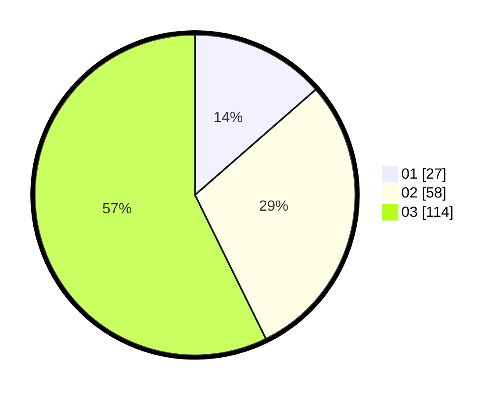

# Hasil

Hasil perolehan suara paslon dapat dilihat pada file paslon-01.txt, paslon-02.txt, dan paslon-03.txt.

Jika tidak ada, artinya data tersebut belum ada pada SIREKAP.

## Perolehan Suara

 * Paslon 01: **27**.
 * Paslon 02: **58**.
 * Paslon 03: **114**.

## Foto C Plano

https://sirekap-obj-formc.kpu.go.id/52ad/pemilu/ppwp/31/75/03/10/06/3175031006119-20240214-193550--5403f9a2-b7af-4dcd-9e2e-4be5dcfe6229.jpg

https://sirekap-obj-formc.kpu.go.id/52ad/pemilu/ppwp/31/75/03/10/06/3175031006119-20240214-193647--64775e19-8d87-4672-854b-983aa7129aed.jpg

https://sirekap-obj-formc.kpu.go.id/52ad/pemilu/ppwp/31/75/03/10/06/3175031006119-20240214-193736--e89101e1-464f-4c95-a9d5-19fc21387ef6.jpg

## DATA PEMILIH TETAP

Jumlah pemilih dalam DPT: **235**.
 * L: **110**.
 * P: **125**.

## DATA PENGGUNA HAK PILIH

Jumlah pengguna hak pilih dalam DPT: **191**.
 * L: **92**.
 * P: **99**.

Jumlah pengguna hak pilih dalam DPTb: **6**.
 * L: **2**.
 * P: **4**.

Jumlah pengguna hak pilih dalam DPK: **3**.
 * L: **0**.
 * P: **3**.

Jumlah pengguna hak pilih: **200**.
 * L: **94**.
 * P: **106**.

## JUMLAH SUARA SAH DAN TIDAK SAH

JUMLAH SELURUH SUARA SAH: **199**.

JUMLAH SUARA TIDAK SAH: **1**.

JUMLAH SELURUH SUARA SAH DAN SUARA TIDAK SAH: **200**.
