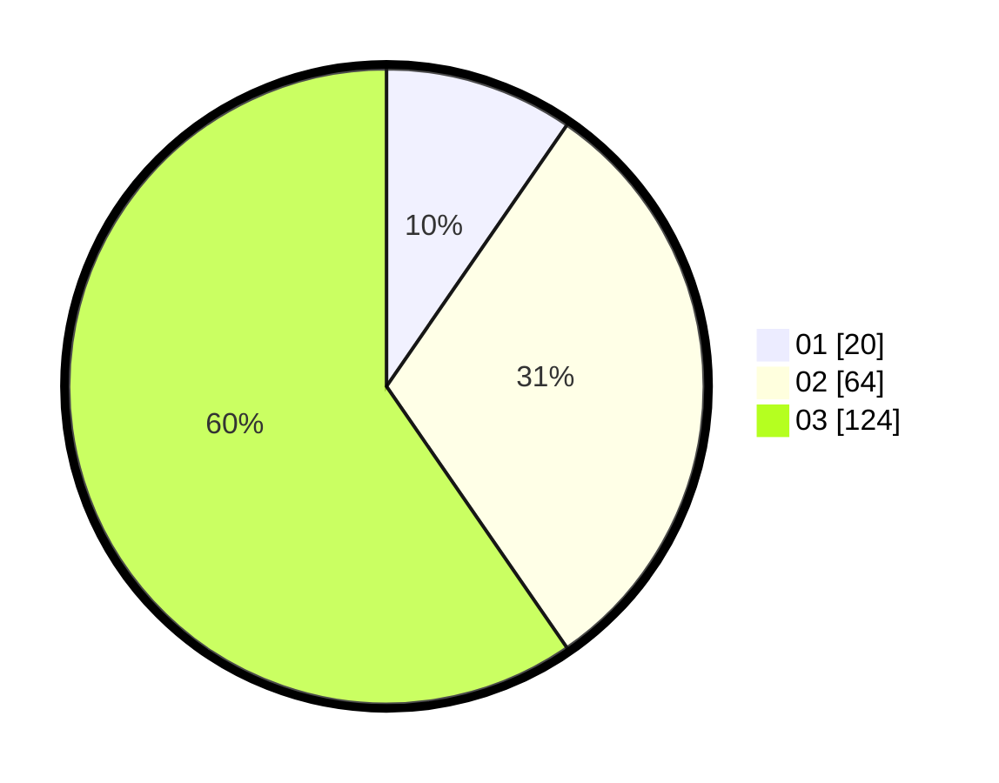

# Hasil

Hasil perolehan suara paslon dapat dilihat pada file paslon-01.txt, paslon-02.txt, dan paslon-03.txt.

Jika tidak ada, artinya data tersebut belum ada pada SIREKAP.

## Perolehan Suara

 * Paslon 01: **20**.
 * Paslon 02: **64**.
 * Paslon 03: **124**.

## Foto C Plano

https://sirekap-obj-formc.kpu.go.id/bfc4/pemilu/ppwp/31/75/03/10/06/3175031006120-20240214-162240--568374ea-2d2c-4df2-896b-25d024c23a81.jpg

https://sirekap-obj-formc.kpu.go.id/bfc4/pemilu/ppwp/31/75/03/10/06/3175031006120-20240214-175444--fdef87ec-3854-485a-a736-d7cd7f40da24.jpg

https://sirekap-obj-formc.kpu.go.id/bfc4/pemilu/ppwp/31/75/03/10/06/3175031006120-20240214-185803--e688ad32-7594-4be0-b795-6b9583f41ddb.jpg

## DATA PEMILIH TETAP

Jumlah pemilih dalam DPT: **243**.
 * L: **120**.
 * P: **123**.

## DATA PENGGUNA HAK PILIH

Jumlah pengguna hak pilih dalam DPT: **201**.
 * L: **97**.
 * P: **104**.

Jumlah pengguna hak pilih dalam DPTb: **7**.
 * L: **4**.
 * P: **3**.

Jumlah pengguna hak pilih dalam DPK: **2**.
 * L: **1**.
 * P: **1**.

Jumlah pengguna hak pilih: **210**.
 * L: **102**.
 * P: **108**.

## JUMLAH SUARA SAH DAN TIDAK SAH

JUMLAH SELURUH SUARA SAH: **208**.

JUMLAH SUARA TIDAK SAH: **2**.

JUMLAH SELURUH SUARA SAH DAN SUARA TIDAK SAH: **210**.
