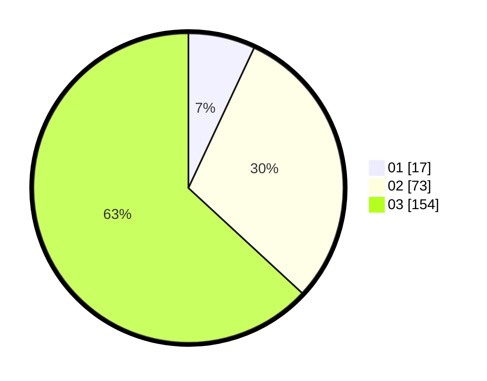

# Hasil

Hasil perolehan suara paslon dapat dilihat pada file paslon-01.txt, paslon-02.txt, dan paslon-03.txt.

Jika tidak ada, artinya data tersebut belum ada pada SIREKAP.

## Perolehan Suara

 * Paslon 01: **17**.
 * Paslon 02: **73**.
 * Paslon 03: **154**.

## Foto C Plano

https://sirekap-obj-formc.kpu.go.id/5a1c/pemilu/ppwp/31/75/03/10/06/3175031006123-20240216-061148--7dc3c585-a279-476e-ba3d-6d57de71abd5.jpg

https://sirekap-obj-formc.kpu.go.id/5a1c/pemilu/ppwp/31/75/03/10/06/3175031006123-20240216-080022--11ba4d91-3b1f-429e-90a0-113adeb3ec45.jpg

https://sirekap-obj-formc.kpu.go.id/5a1c/pemilu/ppwp/31/75/03/10/06/3175031006123-20240216-061150--eac7c5c8-7d68-4de4-a606-43ad35d5ca9f.jpg

## DATA PEMILIH TETAP

Jumlah pemilih dalam DPT: **285**.
 * L: **133**.
 * P: **152**.

## DATA PENGGUNA HAK PILIH

Jumlah pengguna hak pilih dalam DPT: **239**.
 * L: **106**.
 * P: **133**.

Jumlah pengguna hak pilih dalam DPTb: **6**.
 * L: **2**.
 * P: **4**.

Jumlah pengguna hak pilih dalam DPK: **1**.
 * L: **1**.
 * P: **0**.

Jumlah pengguna hak pilih: **246**.
 * L: **109**.
 * P: **137**.

## JUMLAH SUARA SAH DAN TIDAK SAH

JUMLAH SELURUH SUARA SAH: **244**.

JUMLAH SUARA TIDAK SAH: **2**.

JUMLAH SELURUH SUARA SAH DAN SUARA TIDAK SAH: **246**.
