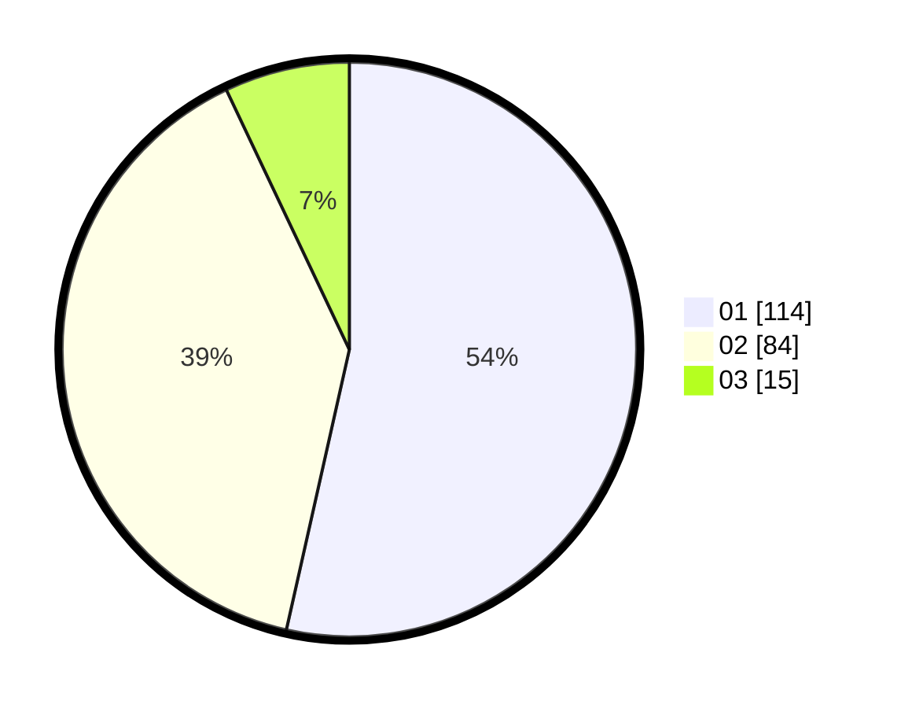

# Hasil

Hasil perolehan suara paslon dapat dilihat pada file paslon-01.txt, paslon-02.txt, dan paslon-03.txt.

Jika tidak ada, artinya data tersebut belum ada pada SIREKAP.

## Perolehan Suara

 * Paslon 01: **114**.
 * Paslon 02: **84**.
 * Paslon 03: **15**.

## Foto C Plano

https://sirekap-obj-formc.kpu.go.id/7953/pemilu/ppwp/31/75/03/10/06/3175031006125-20240214-204907--220846f6-bf1f-4080-9dcc-82ae66c4ff1c.jpg

https://sirekap-obj-formc.kpu.go.id/7953/pemilu/ppwp/31/75/03/10/06/3175031006125-20240214-205047--d615ec92-e3dd-4756-875a-3010750d9e19.jpg

https://sirekap-obj-formc.kpu.go.id/7953/pemilu/ppwp/31/75/03/10/06/3175031006125-20240214-205138--450ada8b-be67-45a4-8645-7cb67e8c846e.jpg

## DATA PEMILIH TETAP

Jumlah pemilih dalam DPT: **262**.
 * L: **129**.
 * P: **133**.

## DATA PENGGUNA HAK PILIH

Jumlah pengguna hak pilih dalam DPT: **215**.
 * L: **104**.
 * P: **111**.

Jumlah pengguna hak pilih dalam DPTb: **1**.
 * L: **0**.
 * P: **1**.

Jumlah pengguna hak pilih dalam DPK: **2**.
 * L: **1**.
 * P: **1**.

Jumlah pengguna hak pilih: **218**.
 * L: **105**.
 * P: **113**.

## JUMLAH SUARA SAH DAN TIDAK SAH

JUMLAH SELURUH SUARA SAH: **213**.

JUMLAH SUARA TIDAK SAH: **5**.

JUMLAH SELURUH SUARA SAH DAN SUARA TIDAK SAH: **218**.
