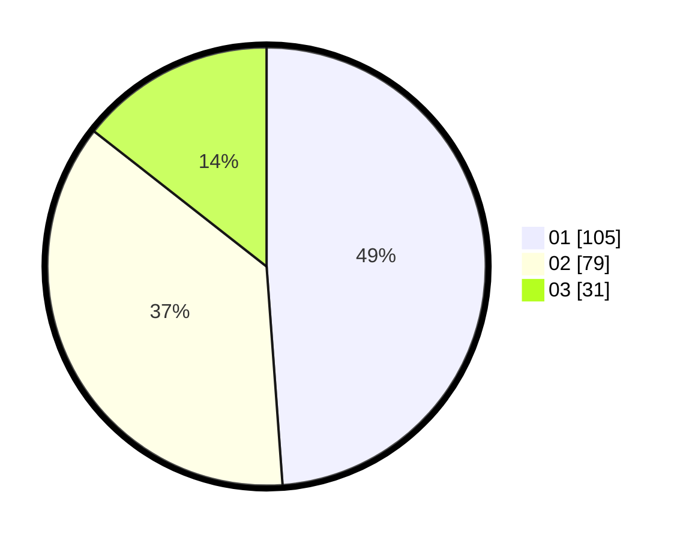

# Hasil

Hasil perolehan suara paslon dapat dilihat pada file paslon-01.txt, paslon-02.txt, dan paslon-03.txt.

Jika tidak ada, artinya data tersebut belum ada pada SIREKAP.

## Perolehan Suara

 * Paslon 01: **105**.
 * Paslon 02: **79**.
 * Paslon 03: **31**.

## Foto C Plano

https://sirekap-obj-formc.kpu.go.id/7e8f/pemilu/ppwp/31/75/03/10/06/3175031006128-20240214-222030--a953ecad-b460-442c-ba9d-b98cf928a085.jpg

https://sirekap-obj-formc.kpu.go.id/7e8f/pemilu/ppwp/31/75/03/10/06/3175031006128-20240214-222157--ba4b769d-82f0-4692-b99e-a477103e1ab5.jpg

https://sirekap-obj-formc.kpu.go.id/7e8f/pemilu/ppwp/31/75/03/10/06/3175031006128-20240214-222312--273bb40d-ecf9-490e-8a82-039041608dca.jpg
