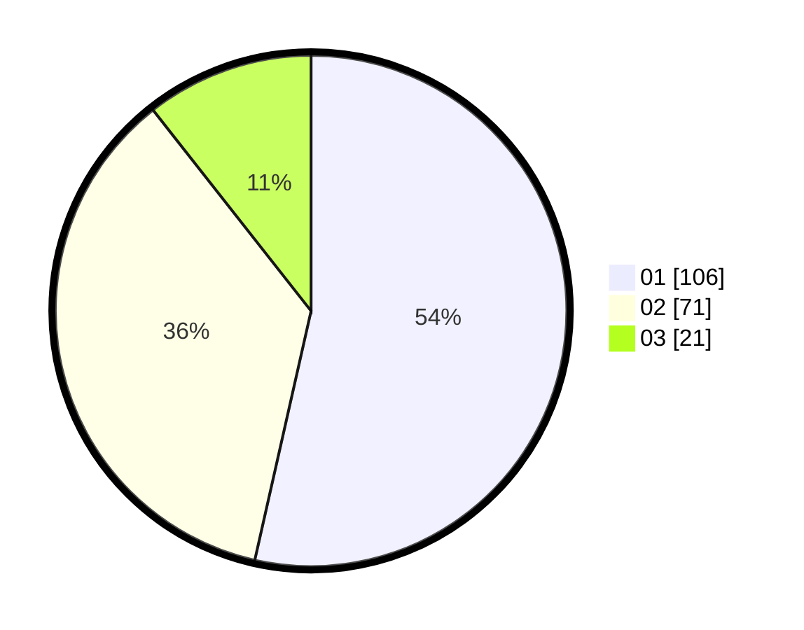

# Hasil

Hasil perolehan suara paslon dapat dilihat pada file paslon-01.txt, paslon-02.txt, dan paslon-03.txt.

Jika tidak ada, artinya data tersebut belum ada pada SIREKAP.

## Perolehan Suara

 * Paslon 01: **106**.
 * Paslon 02: **71**.
 * Paslon 03: **21**.

## Foto C Plano

https://sirekap-obj-formc.kpu.go.id/c1db/pemilu/ppwp/31/75/03/10/06/3175031006129-20240214-222444--d85338c8-fe05-4f04-a2be-5b477337e363.jpg

https://sirekap-obj-formc.kpu.go.id/c1db/pemilu/ppwp/31/75/03/10/06/3175031006129-20240214-233316--38d6dd90-83bd-46da-b386-cd9d80916e25.jpg
