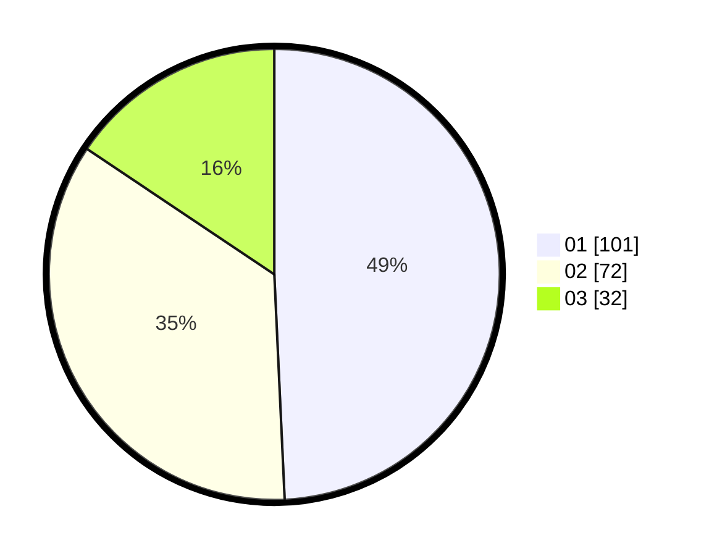

# Hasil

Hasil perolehan suara paslon dapat dilihat pada file paslon-01.txt, paslon-02.txt, dan paslon-03.txt.

Jika tidak ada, artinya data tersebut belum ada pada SIREKAP.

## Perolehan Suara

 * Paslon 01: **101**.
 * Paslon 02: **72**.
 * Paslon 03: **32**.

## Foto C Plano

https://sirekap-obj-formc.kpu.go.id/ee15/pemilu/ppwp/31/75/03/10/06/3175031006134-20240214-222723--aebb31fb-85d5-4e32-8efb-92efa21f40b5.jpg

https://sirekap-obj-formc.kpu.go.id/ee15/pemilu/ppwp/31/75/03/10/06/3175031006134-20240214-222828--8a22d842-ff50-4111-98bd-ee07aa92fc3b.jpg

https://sirekap-obj-formc.kpu.go.id/ee15/pemilu/ppwp/31/75/03/10/06/3175031006134-20240214-222937--b9a13916-8498-4ef9-a334-1c2a85a0b75e.jpg

## DATA PEMILIH TETAP

Jumlah pemilih dalam DPT: **264**.
 * L: **126**.
 * P: **138**.

## DATA PENGGUNA HAK PILIH

Jumlah pengguna hak pilih dalam DPT: **206**.
 * L: **97**.
 * P: **109**.

Jumlah pengguna hak pilih dalam DPTb: **2**.
 * L: **5**.
 * P: **1**.

Jumlah pengguna hak pilih dalam DPK: **1**.
 * L: **1**.
 * P: **0**.

Jumlah pengguna hak pilih: **209**.
 * L: **99**.
 * P: **110**.

## JUMLAH SUARA SAH DAN TIDAK SAH

JUMLAH SELURUH SUARA SAH: **205**.

JUMLAH SUARA TIDAK SAH: **4**.

JUMLAH SELURUH SUARA SAH DAN SUARA TIDAK SAH: **209**.
