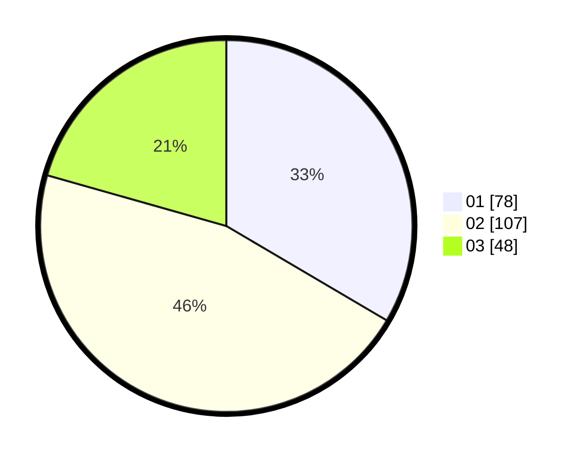

# Hasil

Hasil perolehan suara paslon dapat dilihat pada file paslon-01.txt, paslon-02.txt, dan paslon-03.txt.

Jika tidak ada, artinya data tersebut belum ada pada SIREKAP.

## Perolehan Suara

 * Paslon 01: **78**.
 * Paslon 02: **107**.
 * Paslon 03: **48**.

## Foto C Plano

https://sirekap-obj-formc.kpu.go.id/caa8/pemilu/ppwp/31/75/03/10/06/3175031006145-20240216-010543--699d9278-39a0-429c-822b-a498e35f146f.jpg

https://sirekap-obj-formc.kpu.go.id/caa8/pemilu/ppwp/31/75/03/10/06/3175031006145-20240214-195016--ea26ec93-9717-4817-a6bf-11e9229da65e.jpg

https://sirekap-obj-formc.kpu.go.id/caa8/pemilu/ppwp/31/75/03/10/06/3175031006145-20240214-185644--71142b9a-a81e-44d4-8181-8da9290e355f.jpg

## DATA PEMILIH TETAP

Jumlah pemilih dalam DPT: **296**.
 * L: **155**.
 * P: **141**.

## DATA PENGGUNA HAK PILIH

Jumlah pengguna hak pilih dalam DPT: **235**.
 * L: **113**.
 * P: **122**.

Jumlah pengguna hak pilih dalam DPTb: **0**.
 * L: **0**.
 * P: **0**.

Jumlah pengguna hak pilih dalam DPK: **1**.
 * L: **1**.
 * P: **0**.

Jumlah pengguna hak pilih: **236**.
 * L: **114**.
 * P: **122**.

## JUMLAH SUARA SAH DAN TIDAK SAH

JUMLAH SELURUH SUARA SAH: **233**.

JUMLAH SUARA TIDAK SAH: **3**.

JUMLAH SELURUH SUARA SAH DAN SUARA TIDAK SAH: **236**.
