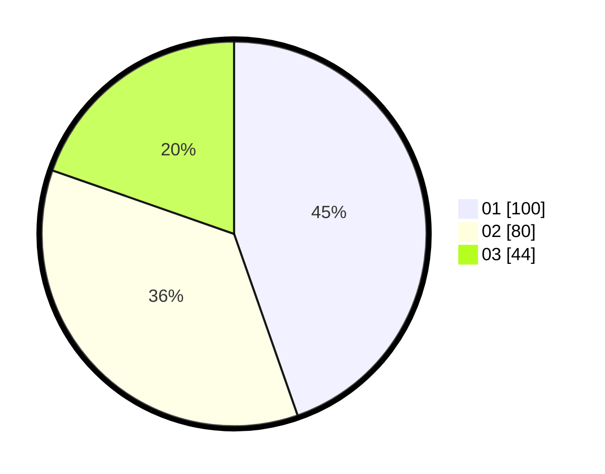

# Hasil

Hasil perolehan suara paslon dapat dilihat pada file paslon-01.txt, paslon-02.txt, dan paslon-03.txt.

Jika tidak ada, artinya data tersebut belum ada pada SIREKAP.

## Perolehan Suara

 * Paslon 01: **100**.
 * Paslon 02: **80**.
 * Paslon 03: **44**.

## Foto C Plano

https://sirekap-obj-formc.kpu.go.id/30d1/pemilu/ppwp/31/75/03/10/06/3175031006147-20240216-000148--35218813-dc5d-4655-b626-ea77dede5d84.jpg

https://sirekap-obj-formc.kpu.go.id/30d1/pemilu/ppwp/31/75/03/10/06/3175031006147-20240216-000154--af0359f5-3c2e-438a-9001-8f4d2e5295a7.jpg

https://sirekap-obj-formc.kpu.go.id/30d1/pemilu/ppwp/31/75/03/10/06/3175031006147-20240216-000151--b9d59db3-b1e6-48a4-b597-ff1a960686df.jpg

## DATA PEMILIH TETAP

Jumlah pemilih dalam DPT: **292**.
 * L: **153**.
 * P: **139**.

## DATA PENGGUNA HAK PILIH

Jumlah pengguna hak pilih dalam DPT: **216**.
 * L: **109**.
 * P: **107**.

Jumlah pengguna hak pilih dalam DPTb: **0**.
 * L: **0**.
 * P: **0**.

Jumlah pengguna hak pilih dalam DPK: **10**.
 * L: **3**.
 * P: **7**.

Jumlah pengguna hak pilih: **226**.
 * L: **112**.
 * P: **114**.

## JUMLAH SUARA SAH DAN TIDAK SAH

JUMLAH SELURUH SUARA SAH: **224**.

JUMLAH SUARA TIDAK SAH: **2**.

JUMLAH SELURUH SUARA SAH DAN SUARA TIDAK SAH: **2**.
