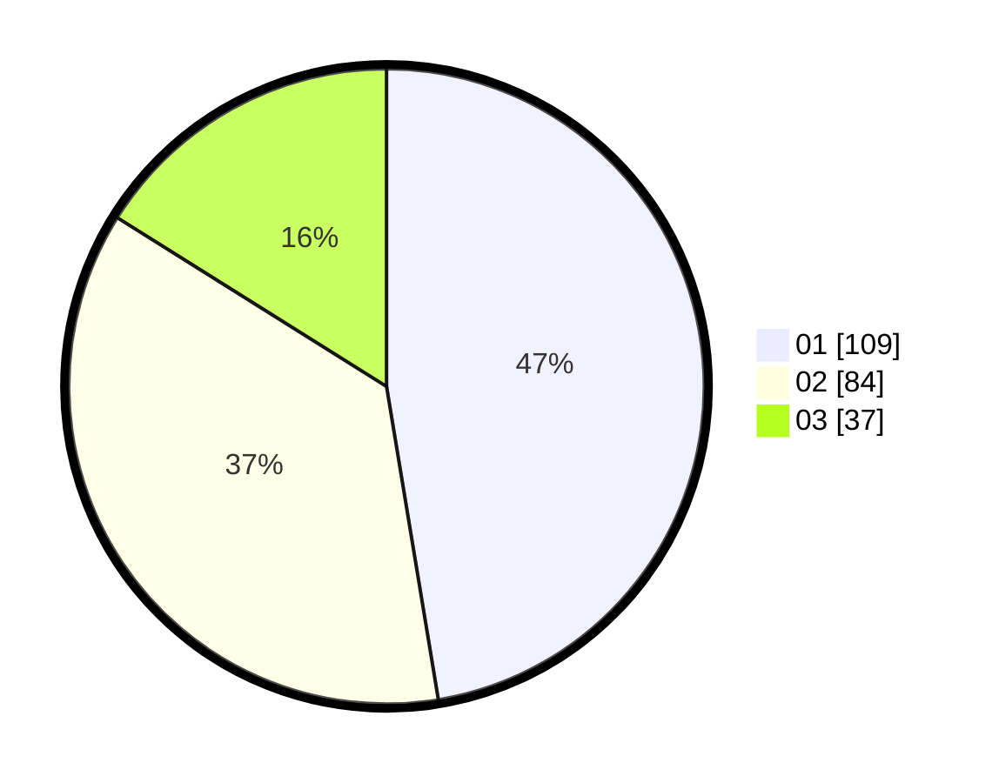

# Hasil

Hasil perolehan suara paslon dapat dilihat pada file paslon-01.txt, paslon-02.txt, dan paslon-03.txt.

Jika tidak ada, artinya data tersebut belum ada pada SIREKAP.

## Perolehan Suara

 * Paslon 01: **109**.
 * Paslon 02: **84**.
 * Paslon 03: **37**.

## Foto C Plano

https://sirekap-obj-formc.kpu.go.id/d2c4/pemilu/ppwp/31/75/03/10/06/3175031006149-20240214-225335--5e95ae41-369f-435e-afba-d2ebe438956d.jpg

https://sirekap-obj-formc.kpu.go.id/d2c4/pemilu/ppwp/31/75/03/10/06/3175031006149-20240214-225445--3a9ad1d7-02f9-4f60-a614-f807d0129ffb.jpg

https://sirekap-obj-formc.kpu.go.id/d2c4/pemilu/ppwp/31/75/03/10/06/3175031006149-20240214-225600--eedfd046-9387-4bc9-8962-4c411d7ac2ea.jpg
