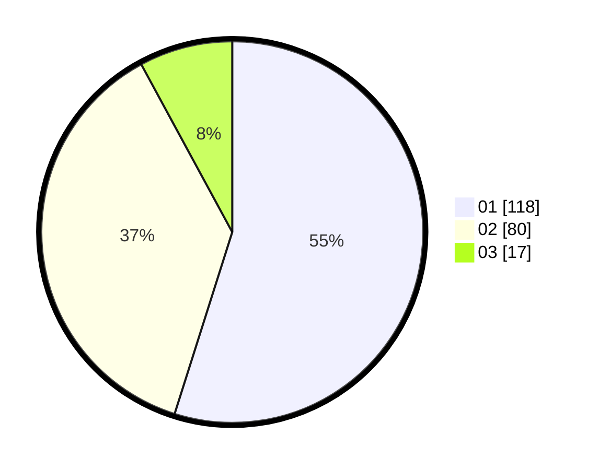

# Hasil

Hasil perolehan suara paslon dapat dilihat pada file paslon-01.txt, paslon-02.txt, dan paslon-03.txt.

Jika tidak ada, artinya data tersebut belum ada pada SIREKAP.

## Perolehan Suara

 * Paslon 01: **118**.
 * Paslon 02: **80**.
 * Paslon 03: **17**.

## Foto C Plano

https://sirekap-obj-formc.kpu.go.id/6fb1/pemilu/ppwp/31/75/03/10/06/3175031006159-20240214-185610--7d051526-c3f7-453c-ba5f-4dae946f4ea2.jpg

https://sirekap-obj-formc.kpu.go.id/6fb1/pemilu/ppwp/31/75/03/10/06/3175031006159-20240214-190812--05308bb3-9988-4dab-bfd8-0b49833b7bf3.jpg

https://sirekap-obj-formc.kpu.go.id/6fb1/pemilu/ppwp/31/75/03/10/06/3175031006159-20240214-191816--6be66c84-635e-48c1-887e-e7befc4bd68e.jpg

## DATA PEMILIH TETAP

Jumlah pemilih dalam DPT: **284**.
 * L: **147**.
 * P: **137**.

## DATA PENGGUNA HAK PILIH

Jumlah pengguna hak pilih dalam DPT: **212**.
 * L: **102**.
 * P: **110**.

Jumlah pengguna hak pilih dalam DPTb: **3**.
 * L: **1**.
 * P: **2**.

Jumlah pengguna hak pilih dalam DPK: **3**.
 * L: **1**.
 * P: **2**.

Jumlah pengguna hak pilih: **218**.
 * L: **104**.
 * P: **114**.

## JUMLAH SUARA SAH DAN TIDAK SAH

JUMLAH SELURUH SUARA SAH: **215**.

JUMLAH SUARA TIDAK SAH: **3**.

JUMLAH SELURUH SUARA SAH DAN SUARA TIDAK SAH: **218**.
