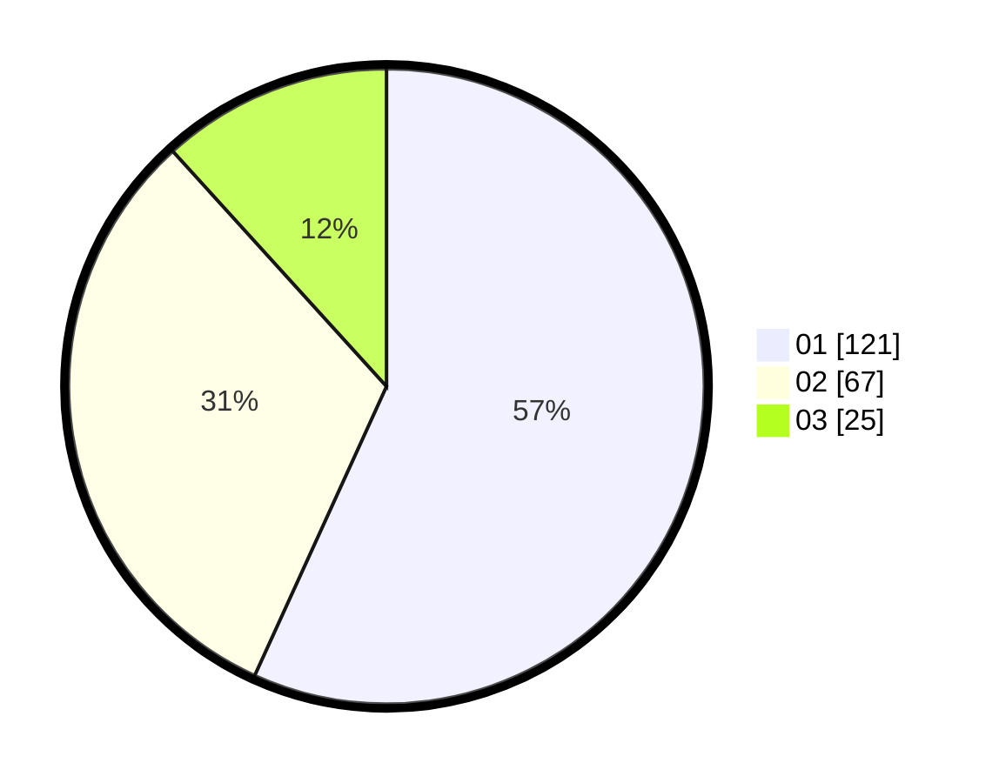

# Hasil

Hasil perolehan suara paslon dapat dilihat pada file paslon-01.txt, paslon-02.txt, dan paslon-03.txt.

Jika tidak ada, artinya data tersebut belum ada pada SIREKAP.

## Perolehan Suara

 * Paslon 01: **121**.
 * Paslon 02: **67**.
 * Paslon 03: **25**.

## Foto C Plano

https://sirekap-obj-formc.kpu.go.id/7f6e/pemilu/ppwp/31/75/03/10/06/3175031006165-20240215-164726--64bd43b9-a630-4161-91bc-05b0bc318944.jpg

https://sirekap-obj-formc.kpu.go.id/7f6e/pemilu/ppwp/31/75/03/10/06/3175031006165-20240215-165150--4c3611e5-724b-44bf-872e-3f95a5f791f0.jpg

https://sirekap-obj-formc.kpu.go.id/7f6e/pemilu/ppwp/31/75/03/10/06/3175031006165-20240215-180609--9df20e78-295b-4c35-952e-980feed6d2c0.jpg
