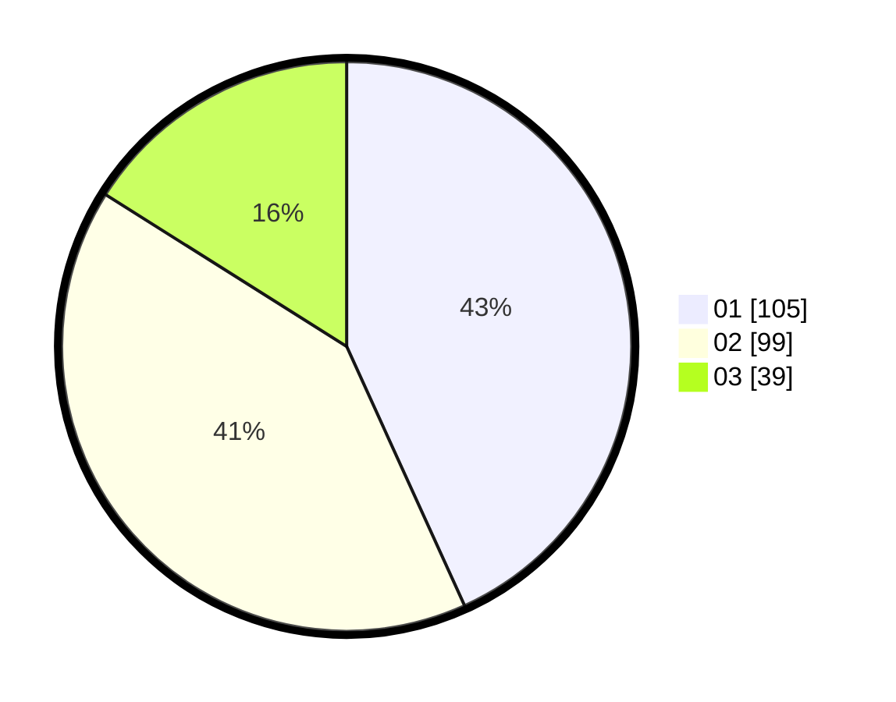

# Hasil

Hasil perolehan suara paslon dapat dilihat pada file paslon-01.txt, paslon-02.txt, dan paslon-03.txt.

Jika tidak ada, artinya data tersebut belum ada pada SIREKAP.

## Perolehan Suara

 * Paslon 01: **105**.
 * Paslon 02: **99**.
 * Paslon 03: **39**.

## Foto C Plano

https://sirekap-obj-formc.kpu.go.id/20d8/pemilu/ppwp/31/75/03/10/06/3175031006168-20240215-162412--fd6f0d67-faba-41d4-824c-d896addc8a17.jpg

https://sirekap-obj-formc.kpu.go.id/20d8/pemilu/ppwp/31/75/03/10/06/3175031006168-20240215-162526--cd3ac60d-abf0-4038-a280-8e62678075cc.jpg

https://sirekap-obj-formc.kpu.go.id/20d8/pemilu/ppwp/31/75/03/10/06/3175031006168-20240215-162609--48e28a42-4f93-425a-84d4-dd5ff45f06cb.jpg
