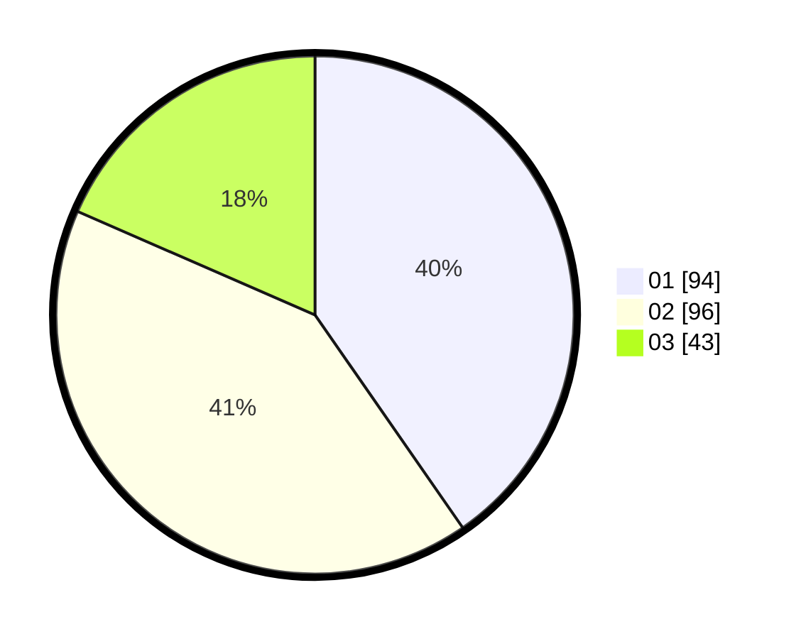

# Hasil

Hasil perolehan suara paslon dapat dilihat pada file paslon-01.txt, paslon-02.txt, dan paslon-03.txt.

Jika tidak ada, artinya data tersebut belum ada pada SIREKAP.

## Perolehan Suara

 * Paslon 01: **94**.
 * Paslon 02: **96**.
 * Paslon 03: **43**.

## Foto C Plano

https://sirekap-obj-formc.kpu.go.id/e6d7/pemilu/ppwp/31/75/03/10/06/3175031006174-20240217-151224--be92bfb2-e537-452e-8963-a72057bd5a5e.jpg

https://sirekap-obj-formc.kpu.go.id/e6d7/pemilu/ppwp/31/75/03/10/06/3175031006174-20240217-151043--401c67bc-4a46-465d-b727-cb2080d5eea2.jpg
