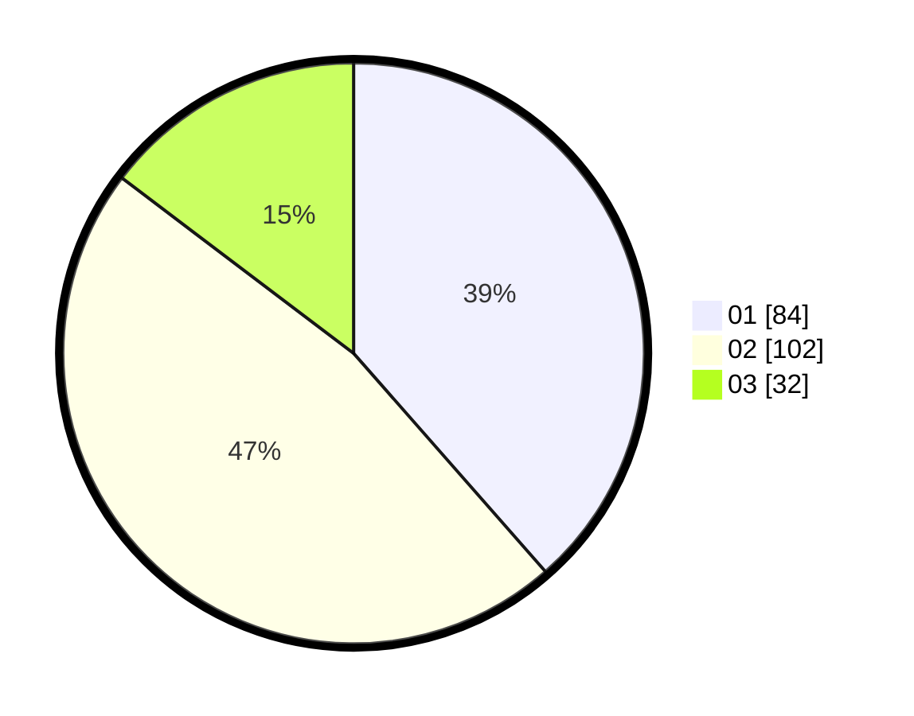

# Hasil

Hasil perolehan suara paslon dapat dilihat pada file paslon-01.txt, paslon-02.txt, dan paslon-03.txt.

Jika tidak ada, artinya data tersebut belum ada pada SIREKAP.

## Perolehan Suara

 * Paslon 01: **84**.
 * Paslon 02: **102**.
 * Paslon 03: **32**.

## Foto C Plano

https://sirekap-obj-formc.kpu.go.id/a84a/pemilu/ppwp/31/75/03/10/06/3175031006175-20240215-021432--f020243e-c40f-4dfc-814d-b26d728edf73.jpg

https://sirekap-obj-formc.kpu.go.id/a84a/pemilu/ppwp/31/75/03/10/06/3175031006175-20240215-021553--15c4bdc3-6e39-48b6-9a9c-81f731aa5695.jpg

https://sirekap-obj-formc.kpu.go.id/a84a/pemilu/ppwp/31/75/03/10/06/3175031006175-20240215-021656--97890670-ce5c-4ca7-8748-2e90199bf0e7.jpg
