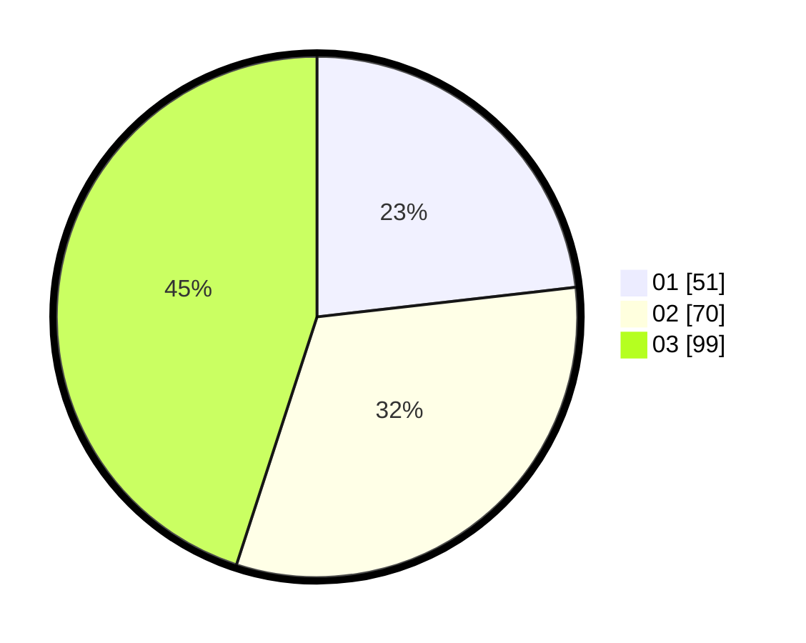

# Hasil

Hasil perolehan suara paslon dapat dilihat pada file paslon-01.txt, paslon-02.txt, dan paslon-03.txt.

Jika tidak ada, artinya data tersebut belum ada pada SIREKAP.

## Perolehan Suara

 * Paslon 01: **51**.
 * Paslon 02: **70**.
 * Paslon 03: **99**.

## Foto C Plano

https://sirekap-obj-formc.kpu.go.id/ac27/pemilu/ppwp/31/75/03/10/06/3175031006179-20240214-201943--a80a5c9b-4e18-4f1d-ae7b-6f7c00e439fe.jpg

https://sirekap-obj-formc.kpu.go.id/ac27/pemilu/ppwp/31/75/03/10/06/3175031006179-20240214-201950--0c44c223-3310-4826-939c-7afbd898a4e1.jpg

https://sirekap-obj-formc.kpu.go.id/ac27/pemilu/ppwp/31/75/03/10/06/3175031006179-20240214-201956--acd99b30-8913-4e53-80c3-804dd81663ff.jpg

## DATA PEMILIH TETAP

Jumlah pemilih dalam DPT: **269**.
 * L: **129**.
 * P: **140**.

## DATA PENGGUNA HAK PILIH

Jumlah pengguna hak pilih dalam DPT: **213**.
 * L: **99**.
 * P: **114**.

Jumlah pengguna hak pilih dalam DPTb: **6**.
 * L: **3**.
 * P: **3**.

Jumlah pengguna hak pilih dalam DPK: **3**.
 * L: **2**.
 * P: **1**.

Jumlah pengguna hak pilih: **222**.
 * L: **104**.
 * P: **118**.

## JUMLAH SUARA SAH DAN TIDAK SAH

JUMLAH SELURUH SUARA SAH: **220**.

JUMLAH SUARA TIDAK SAH: **2**.

JUMLAH SELURUH SUARA SAH DAN SUARA TIDAK SAH: **222**.
