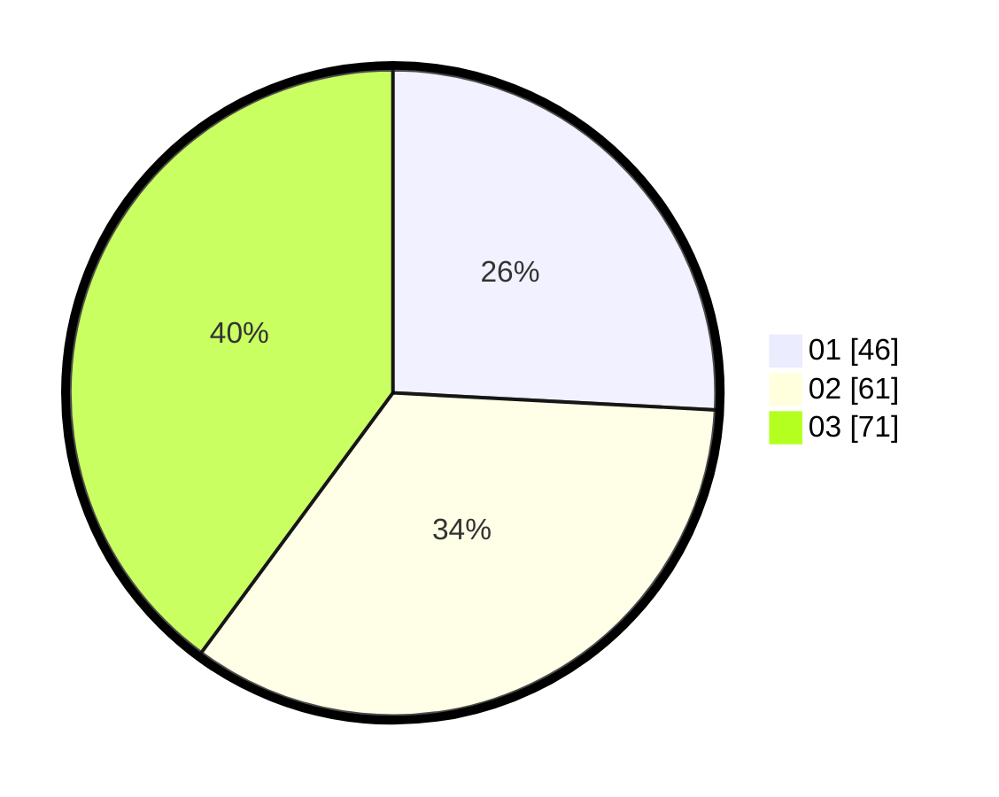

# Hasil

Hasil perolehan suara paslon dapat dilihat pada file paslon-01.txt, paslon-02.txt, dan paslon-03.txt.

Jika tidak ada, artinya data tersebut belum ada pada SIREKAP.

## Perolehan Suara

 * Paslon 01: **46**.
 * Paslon 02: **61**.
 * Paslon 03: **71**.

## Foto C Plano

https://sirekap-obj-formc.kpu.go.id/d8a6/pemilu/ppwp/31/75/03/10/06/3175031006180-20240215-011905--cd755973-7e86-44c5-98a7-3506bcf4a992.jpg

https://sirekap-obj-formc.kpu.go.id/d8a6/pemilu/ppwp/31/75/03/10/06/3175031006180-20240215-012022--18535738-5a64-4191-988a-66cbda1d1426.jpg

https://sirekap-obj-formc.kpu.go.id/d8a6/pemilu/ppwp/31/75/03/10/06/3175031006180-20240215-012139--190e40be-1482-4016-bb43-81559800e172.jpg
