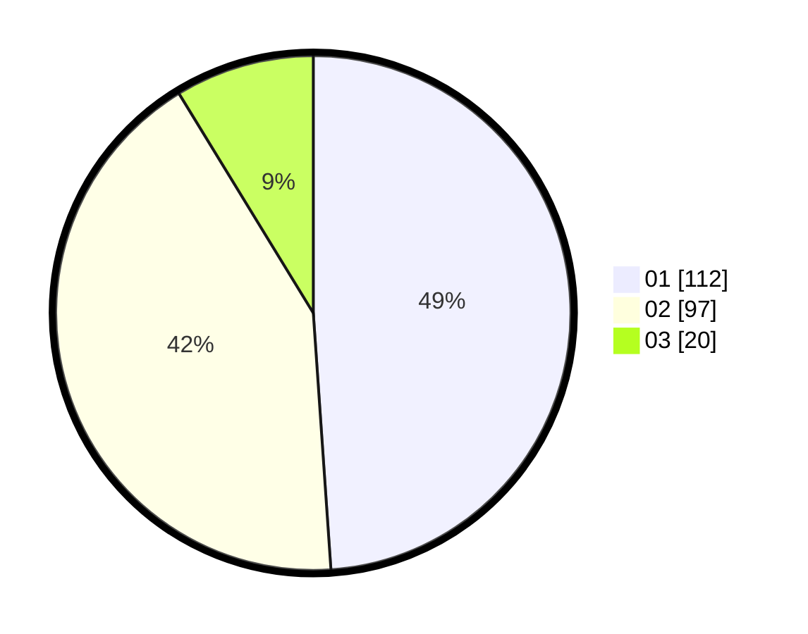

# Hasil

Hasil perolehan suara paslon dapat dilihat pada file paslon-01.txt, paslon-02.txt, dan paslon-03.txt.

Jika tidak ada, artinya data tersebut belum ada pada SIREKAP.

## Perolehan Suara

 * Paslon 01: **112**.
 * Paslon 02: **97**.
 * Paslon 03: **20**.

## Foto C Plano

https://sirekap-obj-formc.kpu.go.id/1bdf/pemilu/ppwp/31/75/03/10/07/3175031007001-20240216-174222--6a00426d-6d7f-4ea0-a5e4-32335599e356.jpg

https://sirekap-obj-formc.kpu.go.id/1bdf/pemilu/ppwp/31/75/03/10/07/3175031007001-20240216-180037--b9b128a9-8bb7-4851-a4d3-aeb078ac8d28.jpg

https://sirekap-obj-formc.kpu.go.id/1bdf/pemilu/ppwp/31/75/03/10/07/3175031007001-20240216-174807--f0058b0c-6117-48db-aeb0-bad3007e64d0.jpg

## DATA PEMILIH TETAP

Jumlah pemilih dalam DPT: **276**.
 * L: **143**.
 * P: **133**.

## DATA PENGGUNA HAK PILIH

Jumlah pengguna hak pilih dalam DPT: **230**.
 * L: **115**.
 * P: **115**.

Jumlah pengguna hak pilih dalam DPTb: **1**.
 * L: **1**.
 * P: **0**.

Jumlah pengguna hak pilih dalam DPK: **2**.
 * L: **1**.
 * P: **1**.

Jumlah pengguna hak pilih: **233**.
 * L: **117**.
 * P: **116**.

## JUMLAH SUARA SAH DAN TIDAK SAH

JUMLAH SELURUH SUARA SAH: **229**.

JUMLAH SUARA TIDAK SAH: **4**.

JUMLAH SELURUH SUARA SAH DAN SUARA TIDAK SAH: **233**.
