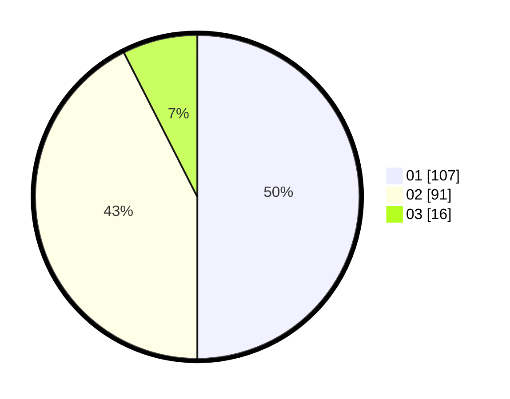

# Hasil

Hasil perolehan suara paslon dapat dilihat pada file paslon-01.txt, paslon-02.txt, dan paslon-03.txt.

Jika tidak ada, artinya data tersebut belum ada pada SIREKAP.

## Perolehan Suara

 * Paslon 01: **107**.
 * Paslon 02: **91**.
 * Paslon 03: **16**.

## Foto C Plano

https://sirekap-obj-formc.kpu.go.id/3d08/pemilu/ppwp/31/75/03/10/07/3175031007003-20240216-010529--05962fc1-9b90-4a52-a4e0-cfaf9af95db6.jpg

https://sirekap-obj-formc.kpu.go.id/3d08/pemilu/ppwp/31/75/03/10/07/3175031007003-20240214-155245--5822ecd3-1993-4d9e-931e-e9e243e3e4d1.jpg

https://sirekap-obj-formc.kpu.go.id/3d08/pemilu/ppwp/31/75/03/10/07/3175031007003-20240214-155412--2b40171d-0307-4dac-ab4b-3b09c5c5a03c.jpg

## DATA PEMILIH TETAP

Jumlah pemilih dalam DPT: **280**.
 * L: **139**.
 * P: **141**.

## DATA PENGGUNA HAK PILIH

Jumlah pengguna hak pilih dalam DPT: **223**.
 * L: **100**.
 * P: **123**.

Jumlah pengguna hak pilih dalam DPTb: **0**.
 * L: **0**.
 * P: **0**.

Jumlah pengguna hak pilih dalam DPK: **0**.
 * L: **0**.
 * P: **0**.

Jumlah pengguna hak pilih: **223**.
 * L: **100**.
 * P: **123**.

## JUMLAH SUARA SAH DAN TIDAK SAH

JUMLAH SELURUH SUARA SAH: **214**.

JUMLAH SUARA TIDAK SAH: **9**.

JUMLAH SELURUH SUARA SAH DAN SUARA TIDAK SAH: **223**.
