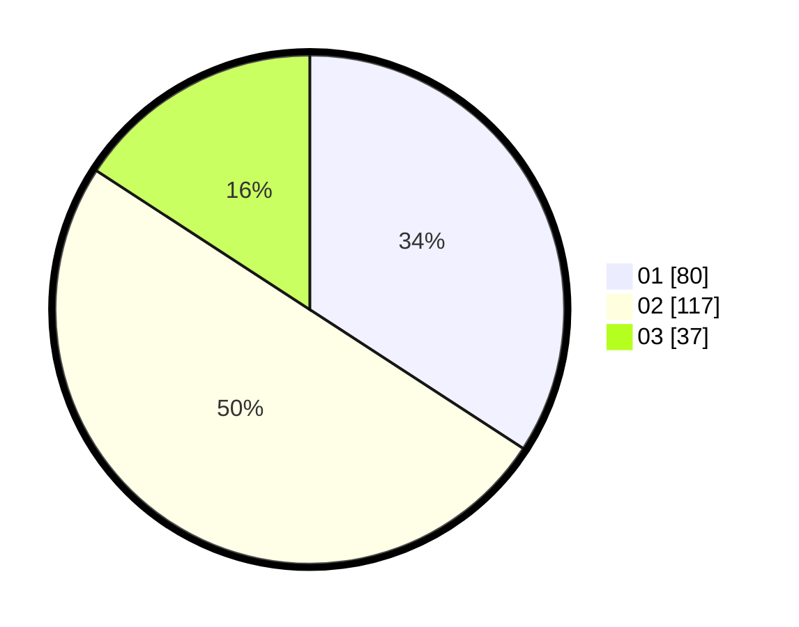

# Hasil

Hasil perolehan suara paslon dapat dilihat pada file paslon-01.txt, paslon-02.txt, dan paslon-03.txt.

Jika tidak ada, artinya data tersebut belum ada pada SIREKAP.

## Perolehan Suara

 * Paslon 01: **80**.
 * Paslon 02: **117**.
 * Paslon 03: **37**.

## Foto C Plano

https://sirekap-obj-formc.kpu.go.id/9b0b/pemilu/ppwp/31/75/03/10/07/3175031007018-20240216-112822--c219fd7a-6e26-48e3-b7ad-45ca16b998f0.jpg

https://sirekap-obj-formc.kpu.go.id/9b0b/pemilu/ppwp/31/75/03/10/07/3175031007018-20240216-121722--824868c7-f465-424f-bc85-b798230bc76c.jpg

https://sirekap-obj-formc.kpu.go.id/9b0b/pemilu/ppwp/31/75/03/10/07/3175031007018-20240216-112134--efc79fe7-ee6e-49b9-a9ca-957b2ac9b242.jpg

## DATA PEMILIH TETAP

Jumlah pemilih dalam DPT: **291**.
 * L: **138**.
 * P: **153**.

## DATA PENGGUNA HAK PILIH

Jumlah pengguna hak pilih dalam DPT: **229**.
 * L: **105**.
 * P: **124**.

Jumlah pengguna hak pilih dalam DPTb: **6**.
 * L: **1**.
 * P: **5**.

Jumlah pengguna hak pilih dalam DPK: **2**.
 * L: **2**.
 * P: **0**.

Jumlah pengguna hak pilih: **237**.
 * L: **108**.
 * P: **129**.

## JUMLAH SUARA SAH DAN TIDAK SAH

JUMLAH SELURUH SUARA SAH: **234**.

JUMLAH SUARA TIDAK SAH: **3**.

JUMLAH SELURUH SUARA SAH DAN SUARA TIDAK SAH: **237**.
