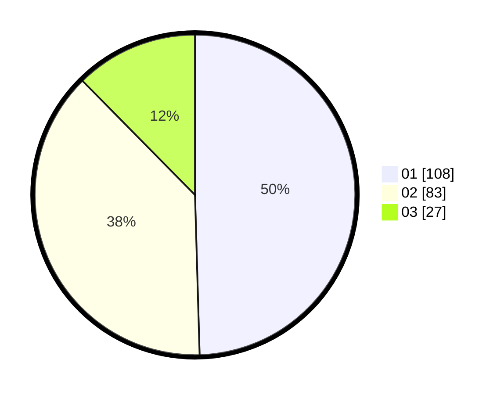

# Hasil

Hasil perolehan suara paslon dapat dilihat pada file paslon-01.txt, paslon-02.txt, dan paslon-03.txt.

Jika tidak ada, artinya data tersebut belum ada pada SIREKAP.

## Perolehan Suara

 * Paslon 01: **108**.
 * Paslon 02: **83**.
 * Paslon 03: **27**.

## Foto C Plano

https://sirekap-obj-formc.kpu.go.id/00f3/pemilu/ppwp/31/75/03/10/07/3175031007021-20240214-193531--28657f91-fc79-4b5c-a63f-fa97a67d8e51.jpg

https://sirekap-obj-formc.kpu.go.id/00f3/pemilu/ppwp/31/75/03/10/07/3175031007021-20240214-193634--77e3810d-ff81-4283-b046-7258da298c49.jpg

https://sirekap-obj-formc.kpu.go.id/00f3/pemilu/ppwp/31/75/03/10/07/3175031007021-20240214-200807--1578797e-b15d-4fb4-8729-bf6513535bdf.jpg
