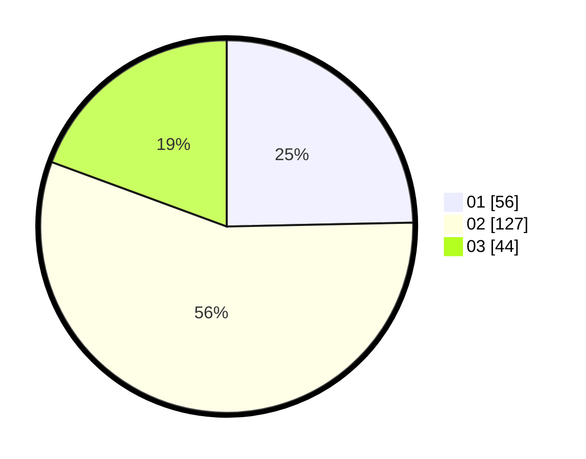

# Hasil

Hasil perolehan suara paslon dapat dilihat pada file paslon-01.txt, paslon-02.txt, dan paslon-03.txt.

Jika tidak ada, artinya data tersebut belum ada pada SIREKAP.

## Perolehan Suara

 * Paslon 01: **56**.
 * Paslon 02: **127**.
 * Paslon 03: **44**.

## Foto C Plano

https://sirekap-obj-formc.kpu.go.id/ce54/pemilu/ppwp/31/75/03/10/07/3175031007023-20240214-193952--a6547fd8-0544-4b1f-95ad-a94c3c5a80fc.jpg

https://sirekap-obj-formc.kpu.go.id/ce54/pemilu/ppwp/31/75/03/10/07/3175031007023-20240214-194111--dd62fe85-07a3-479a-a7e7-1eedf9658b18.jpg

https://sirekap-obj-formc.kpu.go.id/ce54/pemilu/ppwp/31/75/03/10/07/3175031007023-20240214-194147--86a29e52-3c2c-41c4-9a2a-bba0375e22ff.jpg

## DATA PEMILIH TETAP

Jumlah pemilih dalam DPT: **291**.
 * L: **162**.
 * P: **129**.

## DATA PENGGUNA HAK PILIH

Jumlah pengguna hak pilih dalam DPT: **228**.
 * L: **124**.
 * P: **104**.

Jumlah pengguna hak pilih dalam DPTb: **2**.
 * L: **1**.
 * P: **1**.

Jumlah pengguna hak pilih dalam DPK: **4**.
 * L: **2**.
 * P: **2**.

Jumlah pengguna hak pilih: **234**.
 * L: **127**.
 * P: **107**.

## JUMLAH SUARA SAH DAN TIDAK SAH

JUMLAH SELURUH SUARA SAH: **227**.

JUMLAH SUARA TIDAK SAH: **7**.

JUMLAH SELURUH SUARA SAH DAN SUARA TIDAK SAH: **234**.
