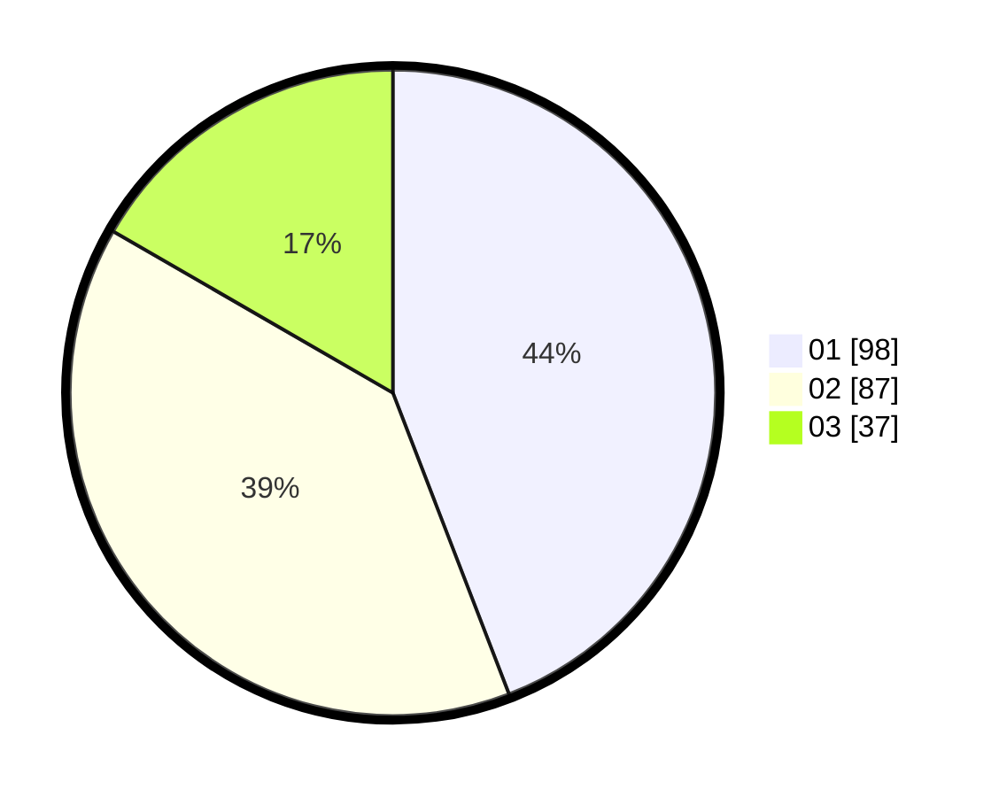

# Hasil

Hasil perolehan suara paslon dapat dilihat pada file paslon-01.txt, paslon-02.txt, dan paslon-03.txt.

Jika tidak ada, artinya data tersebut belum ada pada SIREKAP.

## Perolehan Suara

 * Paslon 01: **98**.
 * Paslon 02: **87**.
 * Paslon 03: **37**.

## Foto C Plano

https://sirekap-obj-formc.kpu.go.id/e12f/pemilu/ppwp/31/75/03/10/07/3175031007024-20240214-201748--b74d4ec3-10c6-4b2f-90f3-1a4520500e2e.jpg

https://sirekap-obj-formc.kpu.go.id/e12f/pemilu/ppwp/31/75/03/10/07/3175031007024-20240214-191423--7ee2097e-821d-499d-8a33-10b776022574.jpg

https://sirekap-obj-formc.kpu.go.id/e12f/pemilu/ppwp/31/75/03/10/07/3175031007024-20240214-191437--c7b4a7e7-37e7-45ed-a84d-1e6787cc481a.jpg

## DATA PEMILIH TETAP

Jumlah pemilih dalam DPT: **280**.
 * L: **140**.
 * P: **140**.

## DATA PENGGUNA HAK PILIH

Jumlah pengguna hak pilih dalam DPT: **226**.
 * L: **109**.
 * P: **117**.

Jumlah pengguna hak pilih dalam DPTb: **3**.
 * L: **2**.
 * P: **1**.

Jumlah pengguna hak pilih dalam DPK: **1**.
 * L: **0**.
 * P: **1**.

Jumlah pengguna hak pilih: **230**.
 * L: **111**.
 * P: **119**.

## JUMLAH SUARA SAH DAN TIDAK SAH

JUMLAH SELURUH SUARA SAH: **222**.

JUMLAH SUARA TIDAK SAH: **8**.

JUMLAH SELURUH SUARA SAH DAN SUARA TIDAK SAH: **230**.
