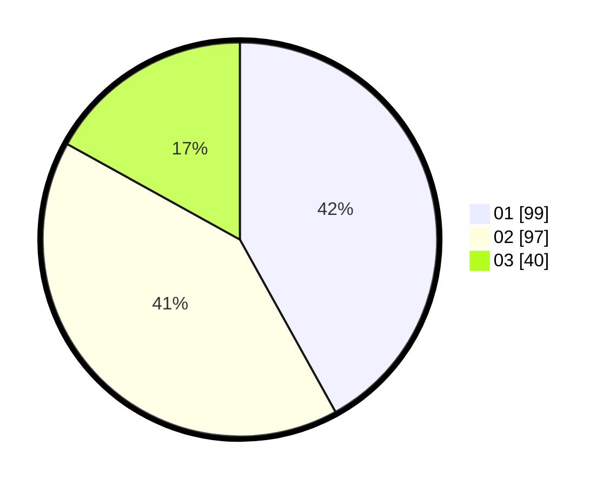

# Hasil

Hasil perolehan suara paslon dapat dilihat pada file paslon-01.txt, paslon-02.txt, dan paslon-03.txt.

Jika tidak ada, artinya data tersebut belum ada pada SIREKAP.

## Perolehan Suara

 * Paslon 01: **99**.
 * Paslon 02: **97**.
 * Paslon 03: **40**.

## Foto C Plano

https://sirekap-obj-formc.kpu.go.id/ca24/pemilu/ppwp/31/75/03/10/07/3175031007025-20240214-234501--61af286d-d30d-4baf-a6eb-13134285fc5a.jpg

https://sirekap-obj-formc.kpu.go.id/ca24/pemilu/ppwp/31/75/03/10/07/3175031007025-20240214-234714--e15c2bfa-6014-46fd-a4a1-f323ef2d8624.jpg

https://sirekap-obj-formc.kpu.go.id/ca24/pemilu/ppwp/31/75/03/10/07/3175031007025-20240214-155557--75fd06f5-00ca-44c8-b763-32a003642fb9.jpg

## DATA PEMILIH TETAP

Jumlah pemilih dalam DPT: **285**.
 * L: **143**.
 * P: **142**.

## DATA PENGGUNA HAK PILIH

Jumlah pengguna hak pilih dalam DPT: **235**.
 * L: **117**.
 * P: **118**.

Jumlah pengguna hak pilih dalam DPTb: **1**.
 * L: **0**.
 * P: **1**.

Jumlah pengguna hak pilih dalam DPK: **2**.
 * L: **1**.
 * P: **1**.

Jumlah pengguna hak pilih: **238**.
 * L: **118**.
 * P: **120**.

## JUMLAH SUARA SAH DAN TIDAK SAH

JUMLAH SELURUH SUARA SAH: **236**.

JUMLAH SUARA TIDAK SAH: **2**.

JUMLAH SELURUH SUARA SAH DAN SUARA TIDAK SAH: **238**.
