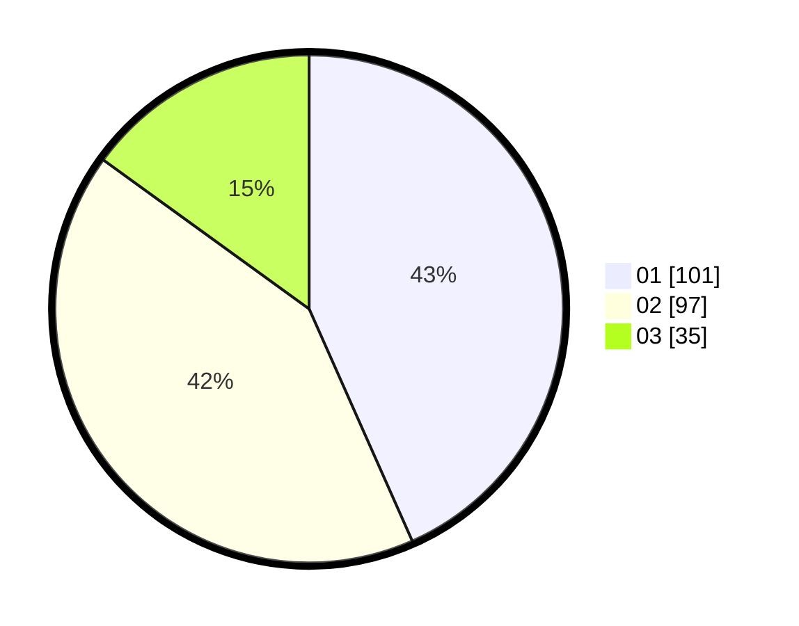

# Hasil

Hasil perolehan suara paslon dapat dilihat pada file paslon-01.txt, paslon-02.txt, dan paslon-03.txt.

Jika tidak ada, artinya data tersebut belum ada pada SIREKAP.

## Perolehan Suara

 * Paslon 01: **101**.
 * Paslon 02: **97**.
 * Paslon 03: **35**.

## Foto C Plano

https://sirekap-obj-formc.kpu.go.id/c9c0/pemilu/ppwp/31/75/03/10/07/3175031007029-20240217-082626--33e59066-f542-4950-851c-cc9b93901155.jpg

https://sirekap-obj-formc.kpu.go.id/c9c0/pemilu/ppwp/31/75/03/10/07/3175031007029-20240216-135544--756513ed-44cf-49f1-aca1-1f4a860d0295.jpg

https://sirekap-obj-formc.kpu.go.id/c9c0/pemilu/ppwp/31/75/03/10/07/3175031007029-20240214-220657--841000fe-692c-4273-910c-7a39284339bb.jpg

## DATA PEMILIH TETAP

Jumlah pemilih dalam DPT: **279**.
 * L: **138**.
 * P: **141**.

## DATA PENGGUNA HAK PILIH

Jumlah pengguna hak pilih dalam DPT: **230**.
 * L: **111**.
 * P: **119**.

Jumlah pengguna hak pilih dalam DPTb: **6**.
 * L: **5**.
 * P: **1**.

Jumlah pengguna hak pilih dalam DPK: **1**.
 * L: **0**.
 * P: **1**.

Jumlah pengguna hak pilih: **237**.
 * L: **116**.
 * P: **121**.

## JUMLAH SUARA SAH DAN TIDAK SAH

JUMLAH SELURUH SUARA SAH: **233**.

JUMLAH SUARA TIDAK SAH: **4**.

JUMLAH SELURUH SUARA SAH DAN SUARA TIDAK SAH: **237**.
