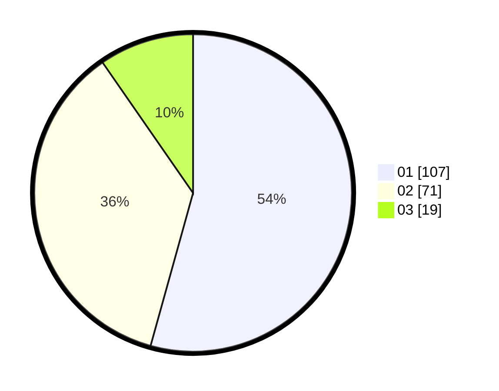

# Hasil

Hasil perolehan suara paslon dapat dilihat pada file paslon-01.txt, paslon-02.txt, dan paslon-03.txt.

Jika tidak ada, artinya data tersebut belum ada pada SIREKAP.

## Perolehan Suara

 * Paslon 01: **107**.
 * Paslon 02: **71**.
 * Paslon 03: **19**.

## Foto C Plano

https://sirekap-obj-formc.kpu.go.id/8313/pemilu/ppwp/31/75/03/10/07/3175031007033-20240214-190734--57e7a84c-e492-46d0-9249-c7852a46e992.jpg

https://sirekap-obj-formc.kpu.go.id/8313/pemilu/ppwp/31/75/03/10/07/3175031007033-20240214-190738--2b616184-c2fd-4c37-b2f6-50050a894e0b.jpg

https://sirekap-obj-formc.kpu.go.id/8313/pemilu/ppwp/31/75/03/10/07/3175031007033-20240214-190743--5a91a779-ceed-4690-989a-7482e2b8cd37.jpg

## DATA PEMILIH TETAP

Jumlah pemilih dalam DPT: **264**.
 * L: **135**.
 * P: **129**.

## DATA PENGGUNA HAK PILIH

Jumlah pengguna hak pilih dalam DPT: **201**.
 * L: **101**.
 * P: **100**.

Jumlah pengguna hak pilih dalam DPTb: **0**.
 * L: **0**.
 * P: **0**.

Jumlah pengguna hak pilih dalam DPK: **1**.
 * L: **0**.
 * P: **1**.

Jumlah pengguna hak pilih: **202**.
 * L: **101**.
 * P: **101**.

## JUMLAH SUARA SAH DAN TIDAK SAH

JUMLAH SELURUH SUARA SAH: **197**.

JUMLAH SUARA TIDAK SAH: **5**.

JUMLAH SELURUH SUARA SAH DAN SUARA TIDAK SAH: **202**.
