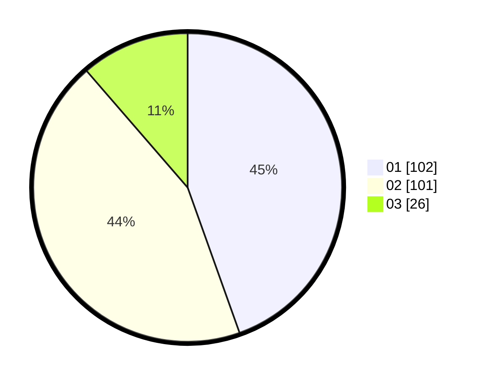

# Hasil

Hasil perolehan suara paslon dapat dilihat pada file paslon-01.txt, paslon-02.txt, dan paslon-03.txt.

Jika tidak ada, artinya data tersebut belum ada pada SIREKAP.

## Perolehan Suara

 * Paslon 01: **102**.
 * Paslon 02: **101**.
 * Paslon 03: **26**.

## Foto C Plano

https://sirekap-obj-formc.kpu.go.id/e134/pemilu/ppwp/31/75/03/10/07/3175031007035-20240217-134438--0e78c87c-5bc5-4fd8-8c5b-f04e98a718a0.jpg

https://sirekap-obj-formc.kpu.go.id/e134/pemilu/ppwp/31/75/03/10/07/3175031007035-20240215-204228--127f2e09-b586-47a5-bb12-4025f5a866c9.jpg
