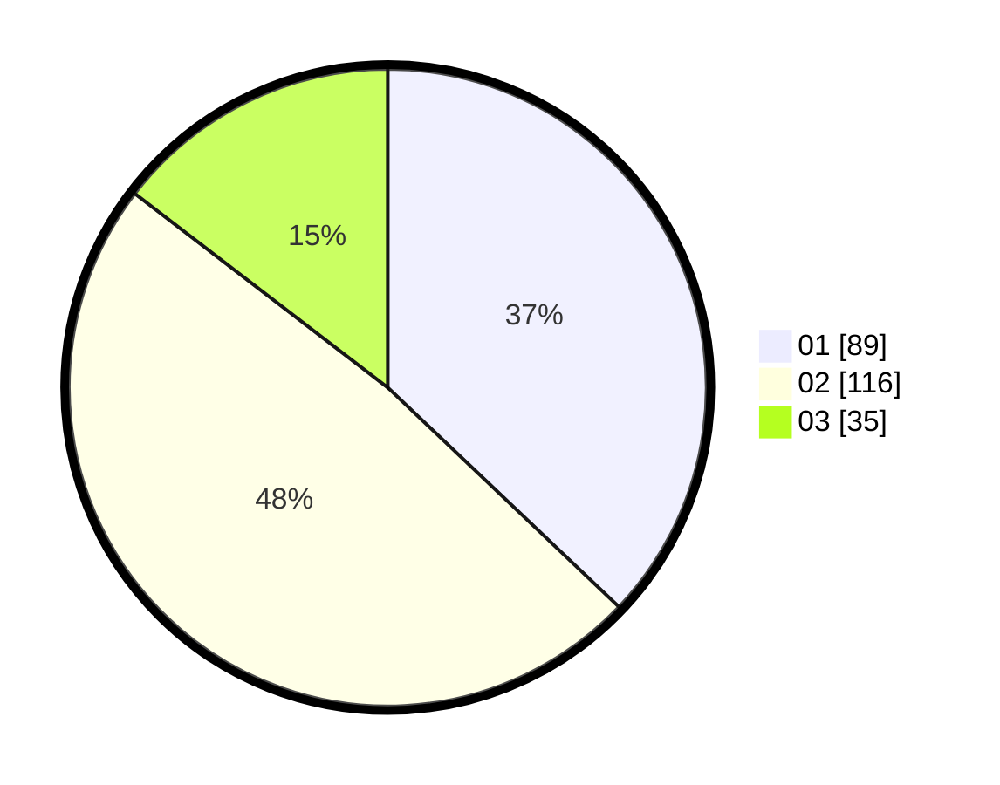

# Hasil

Hasil perolehan suara paslon dapat dilihat pada file paslon-01.txt, paslon-02.txt, dan paslon-03.txt.

Jika tidak ada, artinya data tersebut belum ada pada SIREKAP.

## Perolehan Suara

 * Paslon 01: **89**.
 * Paslon 02: **116**.
 * Paslon 03: **35**.

## Foto C Plano

https://sirekap-obj-formc.kpu.go.id/10a4/pemilu/ppwp/31/75/03/10/07/3175031007038-20240214-212621--6d1be90e-03f2-4cd3-a8dd-8c365c1550fa.jpg

https://sirekap-obj-formc.kpu.go.id/10a4/pemilu/ppwp/31/75/03/10/07/3175031007038-20240214-212726--25161fa5-330a-4d41-9587-f56723d927a7.jpg
