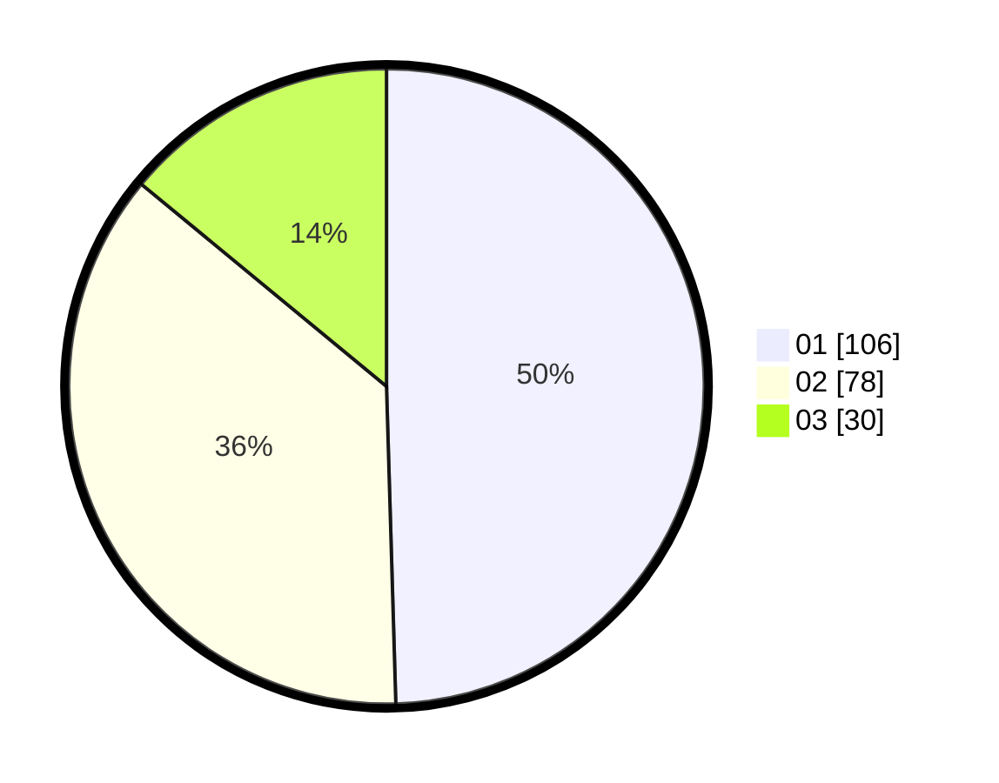

# Hasil

Hasil perolehan suara paslon dapat dilihat pada file paslon-01.txt, paslon-02.txt, dan paslon-03.txt.

Jika tidak ada, artinya data tersebut belum ada pada SIREKAP.

## Perolehan Suara

 * Paslon 01: **106**.
 * Paslon 02: **78**.
 * Paslon 03: **30**.

## Foto C Plano

https://sirekap-obj-formc.kpu.go.id/0983/pemilu/ppwp/31/75/03/10/07/3175031007043-20240214-195457--a960c58a-3b77-48a3-8535-ac473fbd5e16.jpg

https://sirekap-obj-formc.kpu.go.id/0983/pemilu/ppwp/31/75/03/10/07/3175031007043-20240214-195622--22d0dd8a-e3e8-4ede-8734-ade3ed0c0c5e.jpg

https://sirekap-obj-formc.kpu.go.id/0983/pemilu/ppwp/31/75/03/10/07/3175031007043-20240216-153925--566426e0-f1ac-4255-82ef-a609c0de74b4.jpg

## DATA PEMILIH TETAP

Jumlah pemilih dalam DPT: **252**.
 * L: **131**.
 * P: **121**.

## DATA PENGGUNA HAK PILIH

Jumlah pengguna hak pilih dalam DPT: **212**.
 * L: **105**.
 * P: **107**.

Jumlah pengguna hak pilih dalam DPTb: **6**.
 * L: **4**.
 * P: **2**.

Jumlah pengguna hak pilih dalam DPK: **0**.
 * L: **0**.
 * P: **0**.

Jumlah pengguna hak pilih: **218**.
 * L: **109**.
 * P: **109**.

## JUMLAH SUARA SAH DAN TIDAK SAH

JUMLAH SELURUH SUARA SAH: **214**.

JUMLAH SUARA TIDAK SAH: **4**.

JUMLAH SELURUH SUARA SAH DAN SUARA TIDAK SAH: **218**.
