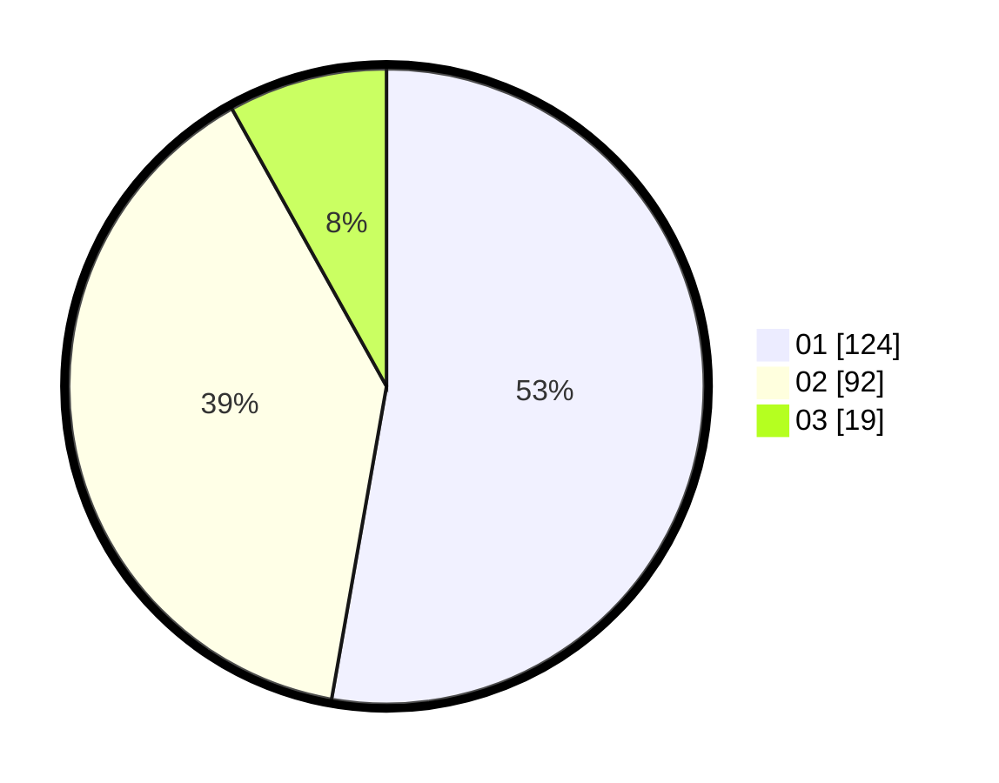

# Hasil

Hasil perolehan suara paslon dapat dilihat pada file paslon-01.txt, paslon-02.txt, dan paslon-03.txt.

Jika tidak ada, artinya data tersebut belum ada pada SIREKAP.

## Perolehan Suara

 * Paslon 01: **124**.
 * Paslon 02: **92**.
 * Paslon 03: **19**.

## Foto C Plano

https://sirekap-obj-formc.kpu.go.id/320a/pemilu/ppwp/31/75/03/10/07/3175031007054-20240214-225010--3f3743f5-a47b-4c41-939f-add675e93682.jpg

https://sirekap-obj-formc.kpu.go.id/320a/pemilu/ppwp/31/75/03/10/07/3175031007054-20240214-225031--8e2c32f2-12ba-4d06-b790-9b44bff76bbe.jpg

https://sirekap-obj-formc.kpu.go.id/320a/pemilu/ppwp/31/75/03/10/07/3175031007054-20240217-101502--20e218e6-2a5f-485c-ba38-cacdf9f07ba0.jpg
