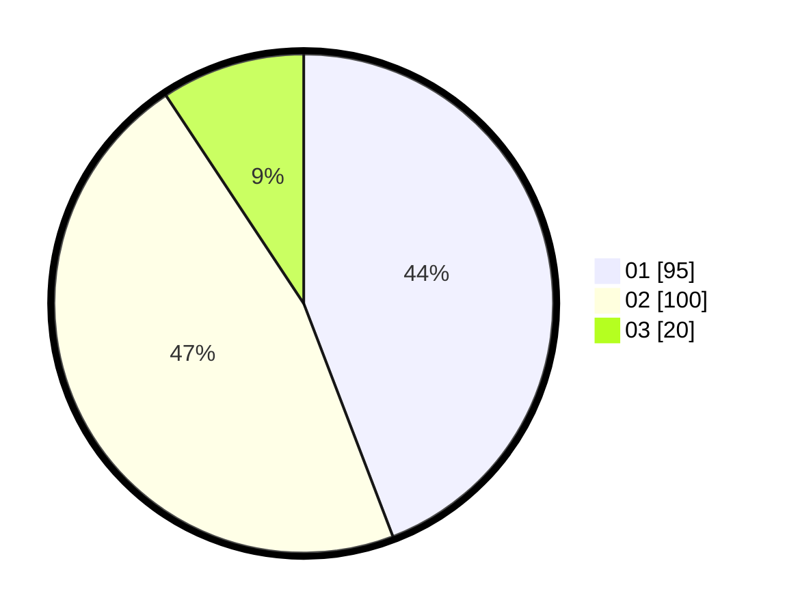

# Hasil

Hasil perolehan suara paslon dapat dilihat pada file paslon-01.txt, paslon-02.txt, dan paslon-03.txt.

Jika tidak ada, artinya data tersebut belum ada pada SIREKAP.

## Perolehan Suara

 * Paslon 01: **95**.
 * Paslon 02: **100**.
 * Paslon 03: **20**.

## Foto C Plano

https://sirekap-obj-formc.kpu.go.id/ccc9/pemilu/ppwp/31/75/03/10/07/3175031007061-20240214-190107--db4816a3-e0dd-461d-af01-6f3ebb9233f5.jpg

https://sirekap-obj-formc.kpu.go.id/ccc9/pemilu/ppwp/31/75/03/10/07/3175031007061-20240214-190224--deedd7f4-d79e-4000-a9e0-a87d7b29bfdf.jpg

https://sirekap-obj-formc.kpu.go.id/ccc9/pemilu/ppwp/31/75/03/10/07/3175031007061-20240214-190419--16b1fa51-4e2a-44df-8671-e7d88681dae1.jpg
