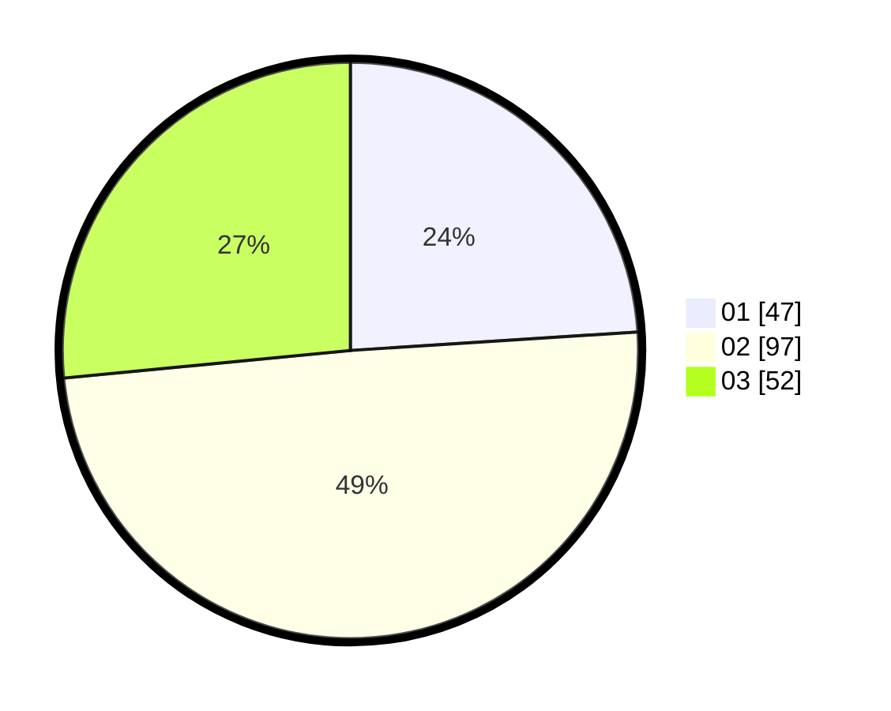

# Hasil

Hasil perolehan suara paslon dapat dilihat pada file paslon-01.txt, paslon-02.txt, dan paslon-03.txt.

Jika tidak ada, artinya data tersebut belum ada pada SIREKAP.

## Perolehan Suara

 * Paslon 01: **47**.
 * Paslon 02: **97**.
 * Paslon 03: **52**.

## Foto C Plano

https://sirekap-obj-formc.kpu.go.id/4584/pemilu/ppwp/31/75/03/10/07/3175031007063-20240214-191123--a1fe5e3c-74de-4d51-8887-bb9587e3ea05.jpg

https://sirekap-obj-formc.kpu.go.id/4584/pemilu/ppwp/31/75/03/10/07/3175031007063-20240214-191135--aeb21e6f-5c15-49a0-a2f3-fc96450bde44.jpg

https://sirekap-obj-formc.kpu.go.id/4584/pemilu/ppwp/31/75/03/10/07/3175031007063-20240214-191139--ece0f5e9-d800-4fde-80e6-efcd02fc8d16.jpg

## DATA PEMILIH TETAP

Jumlah pemilih dalam DPT: **282**.
 * L: **143**.
 * P: **139**.

## DATA PENGGUNA HAK PILIH

Jumlah pengguna hak pilih dalam DPT: **198**.
 * L: **101**.
 * P: **97**.

Jumlah pengguna hak pilih dalam DPTb: **0**.
 * L: **0**.
 * P: **0**.

Jumlah pengguna hak pilih dalam DPK: **0**.
 * L: **0**.
 * P: **0**.

Jumlah pengguna hak pilih: **198**.
 * L: **101**.
 * P: **97**.

## JUMLAH SUARA SAH DAN TIDAK SAH

JUMLAH SELURUH SUARA SAH: **196**.

JUMLAH SUARA TIDAK SAH: **2**.

JUMLAH SELURUH SUARA SAH DAN SUARA TIDAK SAH: **198**.
