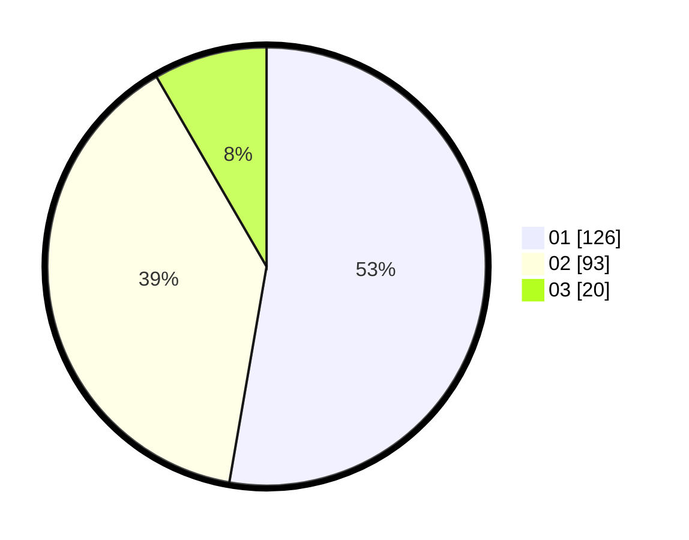

# Hasil

Hasil perolehan suara paslon dapat dilihat pada file paslon-01.txt, paslon-02.txt, dan paslon-03.txt.

Jika tidak ada, artinya data tersebut belum ada pada SIREKAP.

## Perolehan Suara

 * Paslon 01: **126**.
 * Paslon 02: **93**.
 * Paslon 03: **20**.

## Foto C Plano

https://sirekap-obj-formc.kpu.go.id/698f/pemilu/ppwp/31/75/03/10/07/3175031007066-20240214-212810--26e3c6c0-6656-4a4c-bd06-3e01d25b9c9c.jpg

https://sirekap-obj-formc.kpu.go.id/698f/pemilu/ppwp/31/75/03/10/07/3175031007066-20240214-212825--97b82373-bb95-4198-a861-c6a112a3a546.jpg

https://sirekap-obj-formc.kpu.go.id/698f/pemilu/ppwp/31/75/03/10/07/3175031007066-20240214-212841--9da55025-3fda-4a85-a07e-a42df48beb9d.jpg

## DATA PEMILIH TETAP

Jumlah pemilih dalam DPT: **287**.
 * L: **141**.
 * P: **146**.

## DATA PENGGUNA HAK PILIH

Jumlah pengguna hak pilih dalam DPT: **234**.
 * L: **113**.
 * P: **121**.

Jumlah pengguna hak pilih dalam DPTb: **6**.
 * L: **6**.
 * P: **0**.

Jumlah pengguna hak pilih dalam DPK: **2**.
 * L: **2**.
 * P: **0**.

Jumlah pengguna hak pilih: **242**.
 * L: **121**.
 * P: **121**.

## JUMLAH SUARA SAH DAN TIDAK SAH

JUMLAH SELURUH SUARA SAH: **239**.

JUMLAH SUARA TIDAK SAH: **3**.

JUMLAH SELURUH SUARA SAH DAN SUARA TIDAK SAH: **242**.
