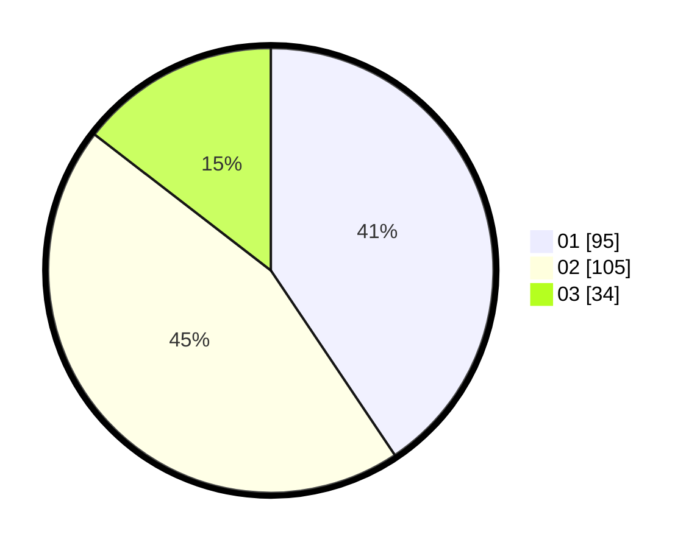

# Hasil

Hasil perolehan suara paslon dapat dilihat pada file paslon-01.txt, paslon-02.txt, dan paslon-03.txt.

Jika tidak ada, artinya data tersebut belum ada pada SIREKAP.

## Perolehan Suara

 * Paslon 01: **95**.
 * Paslon 02: **105**.
 * Paslon 03: **34**.

## Foto C Plano

https://sirekap-obj-formc.kpu.go.id/bc08/pemilu/ppwp/31/75/03/10/07/3175031007067-20240217-103844--06ba08e7-2dc3-469c-a66b-e0bd91602407.jpg

https://sirekap-obj-formc.kpu.go.id/bc08/pemilu/ppwp/31/75/03/10/07/3175031007067-20240217-115956--f0e33633-c087-4b3a-a8ed-fea8243b3a42.jpg

https://sirekap-obj-formc.kpu.go.id/bc08/pemilu/ppwp/31/75/03/10/07/3175031007067-20240217-104506--bbd71114-dd21-4388-b2e3-57c8f960cacd.jpg

## DATA PEMILIH TETAP

Jumlah pemilih dalam DPT: **297**.
 * L: **148**.
 * P: **149**.

## DATA PENGGUNA HAK PILIH

Jumlah pengguna hak pilih dalam DPT: **233**.
 * L: **112**.
 * P: **121**.

Jumlah pengguna hak pilih dalam DPTb: **3**.
 * L: **1**.
 * P: **2**.

Jumlah pengguna hak pilih dalam DPK: **1**.
 * L: **1**.
 * P: **0**.

Jumlah pengguna hak pilih: **237**.
 * L: **114**.
 * P: **123**.

## JUMLAH SUARA SAH DAN TIDAK SAH

JUMLAH SELURUH SUARA SAH: **234**.

JUMLAH SUARA TIDAK SAH: **3**.

JUMLAH SELURUH SUARA SAH DAN SUARA TIDAK SAH: **237**.
