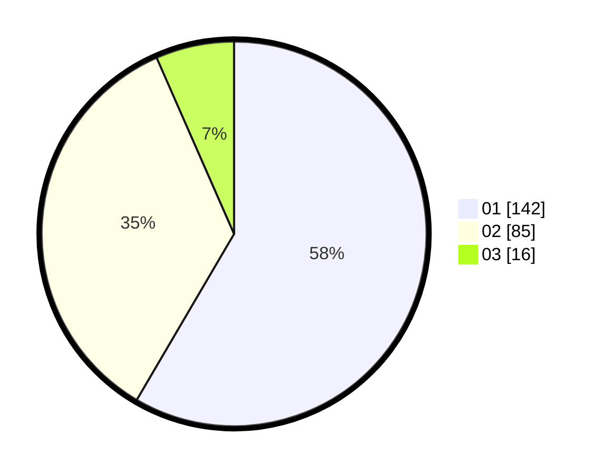

# Hasil

Hasil perolehan suara paslon dapat dilihat pada file paslon-01.txt, paslon-02.txt, dan paslon-03.txt.

Jika tidak ada, artinya data tersebut belum ada pada SIREKAP.

## Perolehan Suara

 * Paslon 01: **142**.
 * Paslon 02: **85**.
 * Paslon 03: **16**.

## Foto C Plano

https://sirekap-obj-formc.kpu.go.id/f9d5/pemilu/ppwp/31/75/03/10/07/3175031007068-20240214-202545--a9cf2ea9-a5d3-47fb-b4a7-4c8195dd9458.jpg

https://sirekap-obj-formc.kpu.go.id/f9d5/pemilu/ppwp/31/75/03/10/07/3175031007068-20240214-162235--8c03ce11-7eb0-4336-9253-26899d11147e.jpg

https://sirekap-obj-formc.kpu.go.id/f9d5/pemilu/ppwp/31/75/03/10/07/3175031007068-20240214-162239--b9999749-c34e-4e2d-a5f8-3637578c7b83.jpg

## DATA PEMILIH TETAP

Jumlah pemilih dalam DPT: **292**.
 * L: **147**.
 * P: **145**.

## DATA PENGGUNA HAK PILIH

Jumlah pengguna hak pilih dalam DPT: **244**.
 * L: **118**.
 * P: **126**.

Jumlah pengguna hak pilih dalam DPTb: **0**.
 * L: **0**.
 * P: **0**.

Jumlah pengguna hak pilih dalam DPK: **1**.
 * L: **1**.
 * P: **0**.

Jumlah pengguna hak pilih: **245**.
 * L: **119**.
 * P: **126**.

## JUMLAH SUARA SAH DAN TIDAK SAH

JUMLAH SELURUH SUARA SAH: **243**.

JUMLAH SUARA TIDAK SAH: **2**.

JUMLAH SELURUH SUARA SAH DAN SUARA TIDAK SAH: **245**.
