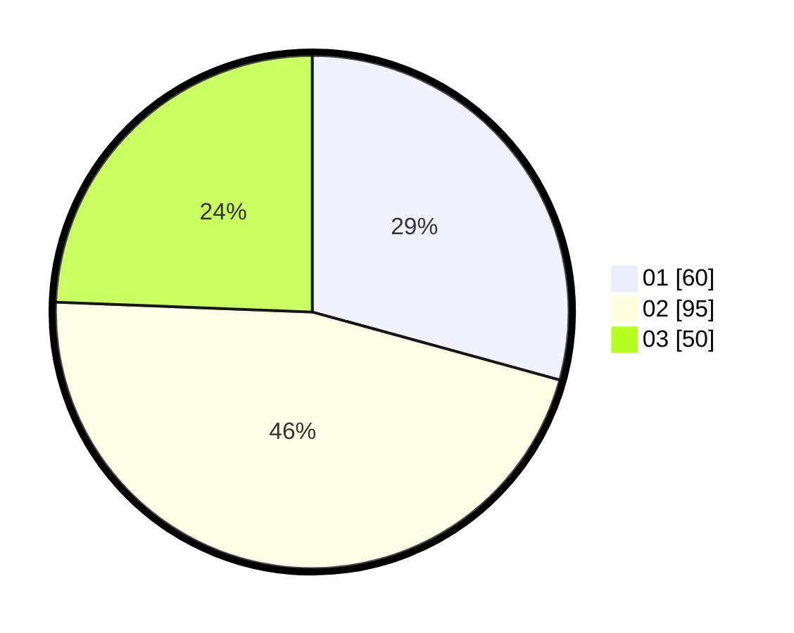

# Hasil

Hasil perolehan suara paslon dapat dilihat pada file paslon-01.txt, paslon-02.txt, dan paslon-03.txt.

Jika tidak ada, artinya data tersebut belum ada pada SIREKAP.

## Perolehan Suara

 * Paslon 01: **60**.
 * Paslon 02: **95**.
 * Paslon 03: **50**.

## Foto C Plano

https://sirekap-obj-formc.kpu.go.id/9450/pemilu/ppwp/31/75/03/10/07/3175031007071-20240214-224528--1078d3a2-4ef0-45ca-b329-def1e0717e6d.jpg

https://sirekap-obj-formc.kpu.go.id/9450/pemilu/ppwp/31/75/03/10/07/3175031007071-20240214-225446--41e14798-b457-47a4-a609-0694e19cee92.jpg
