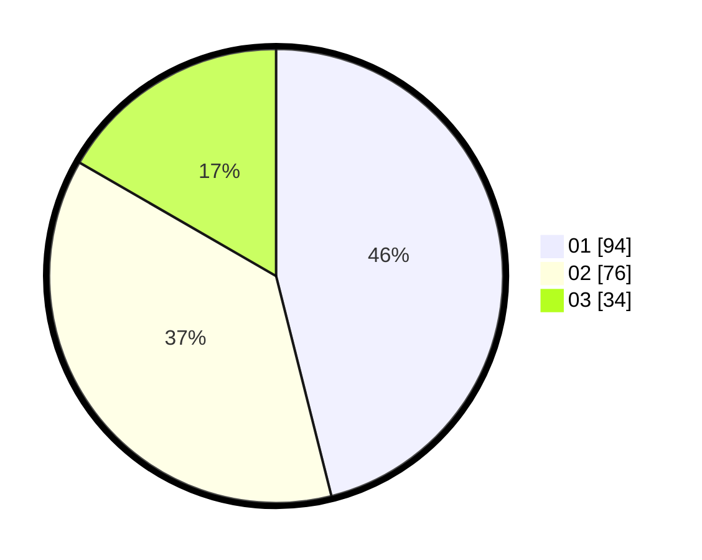

# Hasil

Hasil perolehan suara paslon dapat dilihat pada file paslon-01.txt, paslon-02.txt, dan paslon-03.txt.

Jika tidak ada, artinya data tersebut belum ada pada SIREKAP.

## Perolehan Suara

 * Paslon 01: **94**.
 * Paslon 02: **76**.
 * Paslon 03: **34**.

## Foto C Plano

https://sirekap-obj-formc.kpu.go.id/8934/pemilu/ppwp/31/75/03/10/07/3175031007074-20240214-212210--68d5b95b-f19f-463a-81cf-84b5f9284e41.jpg

https://sirekap-obj-formc.kpu.go.id/8934/pemilu/ppwp/31/75/03/10/07/3175031007074-20240214-212343--96d1b962-862d-4d16-b660-d08b1d6d13d5.jpg
