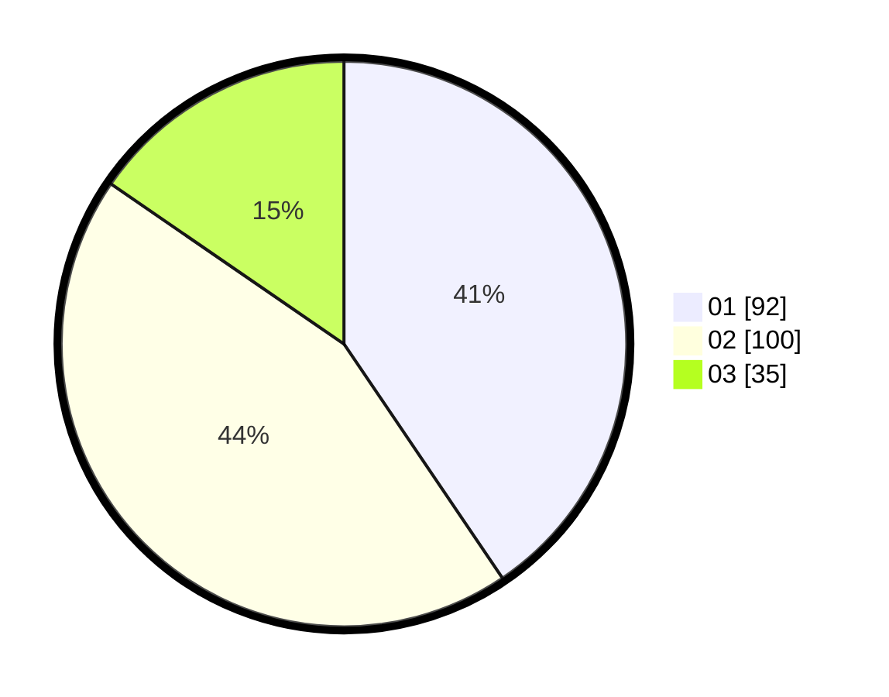

# Hasil

Hasil perolehan suara paslon dapat dilihat pada file paslon-01.txt, paslon-02.txt, dan paslon-03.txt.

Jika tidak ada, artinya data tersebut belum ada pada SIREKAP.

## Perolehan Suara

 * Paslon 01: **92**.
 * Paslon 02: **100**.
 * Paslon 03: **35**.

## Foto C Plano

https://sirekap-obj-formc.kpu.go.id/9e98/pemilu/ppwp/31/75/03/10/07/3175031007084-20240214-155202--be7a44e4-009d-44db-9e3d-ffd131d7cbf5.jpg

https://sirekap-obj-formc.kpu.go.id/9e98/pemilu/ppwp/31/75/03/10/07/3175031007084-20240214-211559--b73c7f48-a393-4d1c-9fe5-d8ea5622c512.jpg

https://sirekap-obj-formc.kpu.go.id/9e98/pemilu/ppwp/31/75/03/10/07/3175031007084-20240214-155403--08a11668-015a-4fb9-a8f9-675c366c0de8.jpg

## DATA PEMILIH TETAP

Jumlah pemilih dalam DPT: **291**.
 * L: **137**.
 * P: **154**.

## DATA PENGGUNA HAK PILIH

Jumlah pengguna hak pilih dalam DPT: **203**.
 * L: **95**.
 * P: **108**.

Jumlah pengguna hak pilih dalam DPTb: **19**.
 * L: **8**.
 * P: **11**.

Jumlah pengguna hak pilih dalam DPK: **6**.
 * L: **2**.
 * P: **4**.

Jumlah pengguna hak pilih: **228**.
 * L: **105**.
 * P: **123**.

## JUMLAH SUARA SAH DAN TIDAK SAH

JUMLAH SELURUH SUARA SAH: **227**.

JUMLAH SUARA TIDAK SAH: **1**.

JUMLAH SELURUH SUARA SAH DAN SUARA TIDAK SAH: **228**.
