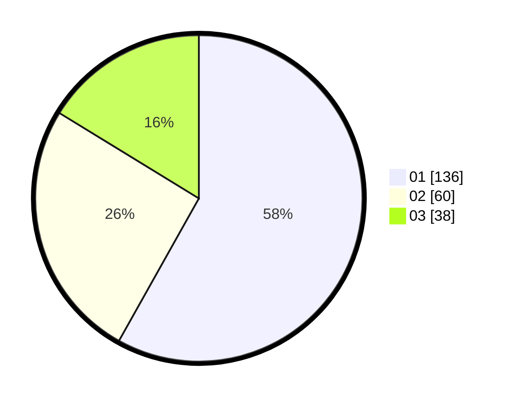

# Hasil

Hasil perolehan suara paslon dapat dilihat pada file paslon-01.txt, paslon-02.txt, dan paslon-03.txt.

Jika tidak ada, artinya data tersebut belum ada pada SIREKAP.

## Perolehan Suara

 * Paslon 01: **136**.
 * Paslon 02: **60**.
 * Paslon 03: **38**.

## Foto C Plano

https://sirekap-obj-formc.kpu.go.id/fa38/pemilu/ppwp/31/75/03/10/07/3175031007088-20240215-003043--428e680b-127d-409f-90a6-b805c7daaa03.jpg

https://sirekap-obj-formc.kpu.go.id/fa38/pemilu/ppwp/31/75/03/10/07/3175031007088-20240216-222413--f181bb16-42a0-4e0d-954f-ec11803f97ba.jpg

https://sirekap-obj-formc.kpu.go.id/fa38/pemilu/ppwp/31/75/03/10/07/3175031007088-20240215-003300--c440c802-622a-435e-97eb-8bcdaf0c3ce9.jpg

## DATA PEMILIH TETAP

Jumlah pemilih dalam DPT: **291**.
 * L: **143**.
 * P: **148**.

## DATA PENGGUNA HAK PILIH

Jumlah pengguna hak pilih dalam DPT: **227**.
 * L: **110**.
 * P: **117**.

Jumlah pengguna hak pilih dalam DPTb: **8**.
 * L: **3**.
 * P: **5**.

Jumlah pengguna hak pilih dalam DPK: **1**.
 * L: **1**.
 * P: **0**.

Jumlah pengguna hak pilih: **236**.
 * L: **114**.
 * P: **122**.

## JUMLAH SUARA SAH DAN TIDAK SAH

JUMLAH SELURUH SUARA SAH: **234**.

JUMLAH SUARA TIDAK SAH: **2**.

JUMLAH SELURUH SUARA SAH DAN SUARA TIDAK SAH: **236**.
