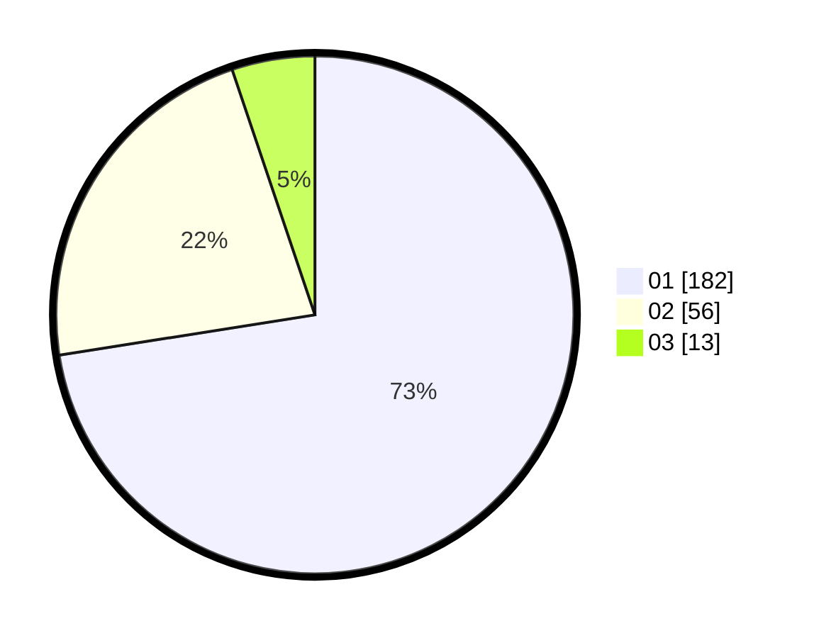

# Hasil

Hasil perolehan suara paslon dapat dilihat pada file paslon-01.txt, paslon-02.txt, dan paslon-03.txt.

Jika tidak ada, artinya data tersebut belum ada pada SIREKAP.

## Perolehan Suara

 * Paslon 01: **182**.
 * Paslon 02: **56**.
 * Paslon 03: **13**.

## Foto C Plano

https://sirekap-obj-formc.kpu.go.id/8a54/pemilu/ppwp/31/75/03/10/07/3175031007090-20240217-075247--735ee70d-2bc5-4f9d-a300-2f2164de970f.jpg

https://sirekap-obj-formc.kpu.go.id/8a54/pemilu/ppwp/31/75/03/10/07/3175031007090-20240217-075340--7faf70d5-b475-4778-a4cb-9b7d12a685c5.jpg

https://sirekap-obj-formc.kpu.go.id/8a54/pemilu/ppwp/31/75/03/10/07/3175031007090-20240217-075928--923aafe9-d2b0-4356-9219-dddc681105ee.jpg

## DATA PEMILIH TETAP

Jumlah pemilih dalam DPT: **282**.
 * L: **132**.
 * P: **150**.

## DATA PENGGUNA HAK PILIH

Jumlah pengguna hak pilih dalam DPT: **233**.
 * L: **103**.
 * P: **130**.

Jumlah pengguna hak pilih dalam DPTb: **8**.
 * L: **3**.
 * P: **5**.

Jumlah pengguna hak pilih dalam DPK: **10**.
 * L: **5**.
 * P: **5**.

Jumlah pengguna hak pilih: **251**.
 * L: **111**.
 * P: **140**.

## JUMLAH SUARA SAH DAN TIDAK SAH

JUMLAH SELURUH SUARA SAH: **250**.

JUMLAH SUARA TIDAK SAH: **1**.

JUMLAH SELURUH SUARA SAH DAN SUARA TIDAK SAH: **251**.
