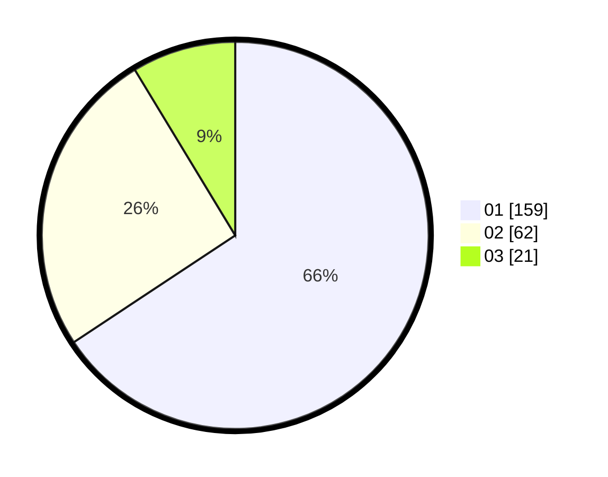

# Hasil

Hasil perolehan suara paslon dapat dilihat pada file paslon-01.txt, paslon-02.txt, dan paslon-03.txt.

Jika tidak ada, artinya data tersebut belum ada pada SIREKAP.

## Perolehan Suara

 * Paslon 01: **159**.
 * Paslon 02: **62**.
 * Paslon 03: **21**.

## Foto C Plano

https://sirekap-obj-formc.kpu.go.id/8de2/pemilu/ppwp/31/75/03/10/07/3175031007091-20240215-011018--a503aeb1-e65e-4eb8-9cbe-1f9be31f9e45.jpg

https://sirekap-obj-formc.kpu.go.id/8de2/pemilu/ppwp/31/75/03/10/07/3175031007091-20240215-011151--0f00993a-311e-4fe1-ab9e-9621971eab89.jpg

https://sirekap-obj-formc.kpu.go.id/8de2/pemilu/ppwp/31/75/03/10/07/3175031007091-20240215-011333--7b66965e-2091-4573-a41c-7da8710a5750.jpg

## DATA PEMILIH TETAP

Jumlah pemilih dalam DPT: **283**.
 * L: **143**.
 * P: **140**.

## DATA PENGGUNA HAK PILIH

Jumlah pengguna hak pilih dalam DPT: **238**.
 * L: **125**.
 * P: **113**.

Jumlah pengguna hak pilih dalam DPTb: **7**.
 * L: **1**.
 * P: **6**.

Jumlah pengguna hak pilih dalam DPK: **0**.
 * L: **0**.
 * P: **0**.

Jumlah pengguna hak pilih: **245**.
 * L: **126**.
 * P: **119**.

## JUMLAH SUARA SAH DAN TIDAK SAH

JUMLAH SELURUH SUARA SAH: **242**.

JUMLAH SUARA TIDAK SAH: **3**.

JUMLAH SELURUH SUARA SAH DAN SUARA TIDAK SAH: **245**.
