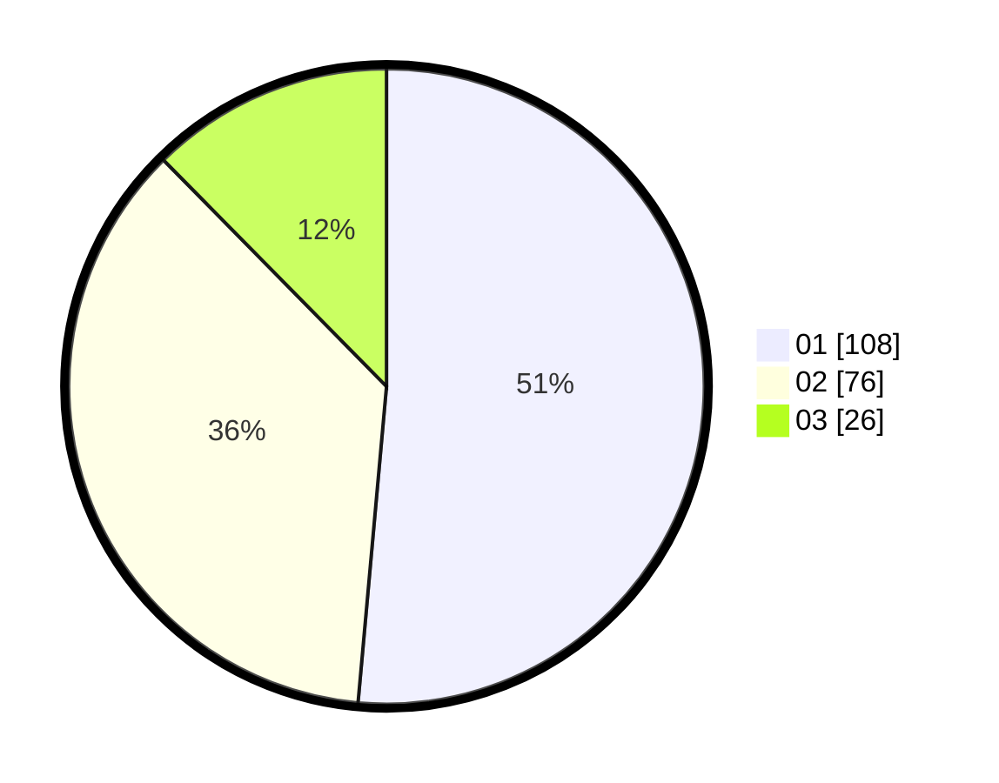

# Hasil

Hasil perolehan suara paslon dapat dilihat pada file paslon-01.txt, paslon-02.txt, dan paslon-03.txt.

Jika tidak ada, artinya data tersebut belum ada pada SIREKAP.

## Perolehan Suara

 * Paslon 01: **108**.
 * Paslon 02: **76**.
 * Paslon 03: **26**.

## Foto C Plano

https://sirekap-obj-formc.kpu.go.id/0d44/pemilu/ppwp/31/75/03/10/07/3175031007093-20240216-011549--4e6f5a48-52f2-4d74-9ec4-a6d600f4fec9.jpg

https://sirekap-obj-formc.kpu.go.id/0d44/pemilu/ppwp/31/75/03/10/07/3175031007093-20240216-011552--49c7a1cc-9f8d-4821-b25f-7ac97072e549.jpg

https://sirekap-obj-formc.kpu.go.id/0d44/pemilu/ppwp/31/75/03/10/07/3175031007093-20240216-011551--cd219e47-c0c1-49c6-a79b-1fe9344c6773.jpg

## DATA PEMILIH TETAP

Jumlah pemilih dalam DPT: **261**.
 * L: **129**.
 * P: **132**.

## DATA PENGGUNA HAK PILIH

Jumlah pengguna hak pilih dalam DPT: **202**.
 * L: **97**.
 * P: **105**.

Jumlah pengguna hak pilih dalam DPTb: **1**.
 * L: **0**.
 * P: **1**.

Jumlah pengguna hak pilih dalam DPK: **7**.
 * L: **6**.
 * P: **1**.

Jumlah pengguna hak pilih: **210**.
 * L: **103**.
 * P: **107**.

## JUMLAH SUARA SAH DAN TIDAK SAH

JUMLAH SELURUH SUARA SAH: **210**.

JUMLAH SUARA TIDAK SAH: **0**.

JUMLAH SELURUH SUARA SAH DAN SUARA TIDAK SAH: **210**.
