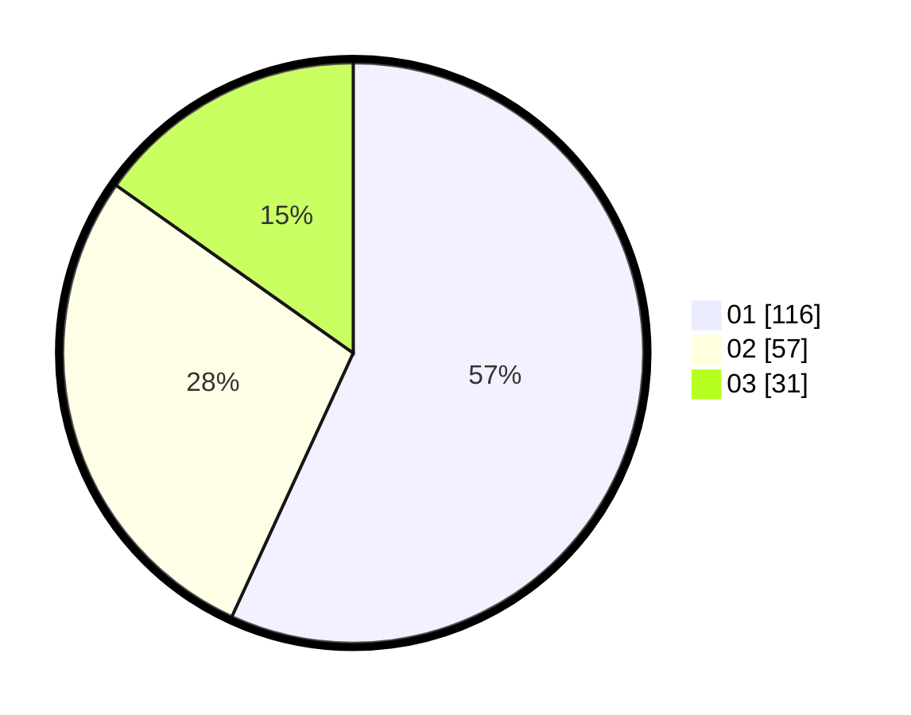

# Hasil

Hasil perolehan suara paslon dapat dilihat pada file paslon-01.txt, paslon-02.txt, dan paslon-03.txt.

Jika tidak ada, artinya data tersebut belum ada pada SIREKAP.

## Perolehan Suara

 * Paslon 01: **116**.
 * Paslon 02: **57**.
 * Paslon 03: **31**.

## Foto C Plano

https://sirekap-obj-formc.kpu.go.id/0522/pemilu/ppwp/31/75/03/10/07/3175031007094-20240215-154234--2f5cbcd1-f85b-416d-8a52-834850e5f171.jpg

https://sirekap-obj-formc.kpu.go.id/0522/pemilu/ppwp/31/75/03/10/07/3175031007094-20240215-154332--03dd0e73-7102-490c-8621-5261f6a3f8d0.jpg

https://sirekap-obj-formc.kpu.go.id/0522/pemilu/ppwp/31/75/03/10/07/3175031007094-20240216-100705--527d4f93-94a4-4964-b611-e9b4160daa61.jpg

## DATA PEMILIH TETAP

Jumlah pemilih dalam DPT: **266**.
 * L: **133**.
 * P: **133**.

## DATA PENGGUNA HAK PILIH

Jumlah pengguna hak pilih dalam DPT: **202**.
 * L: **94**.
 * P: **108**.

Jumlah pengguna hak pilih dalam DPTb: **3**.
 * L: **2**.
 * P: **1**.

Jumlah pengguna hak pilih dalam DPK: **2**.
 * L: **1**.
 * P: **1**.

Jumlah pengguna hak pilih: **207**.
 * L: **97**.
 * P: **110**.

## JUMLAH SUARA SAH DAN TIDAK SAH

JUMLAH SELURUH SUARA SAH: **204**.

JUMLAH SUARA TIDAK SAH: **3**.

JUMLAH SELURUH SUARA SAH DAN SUARA TIDAK SAH: **207**.
