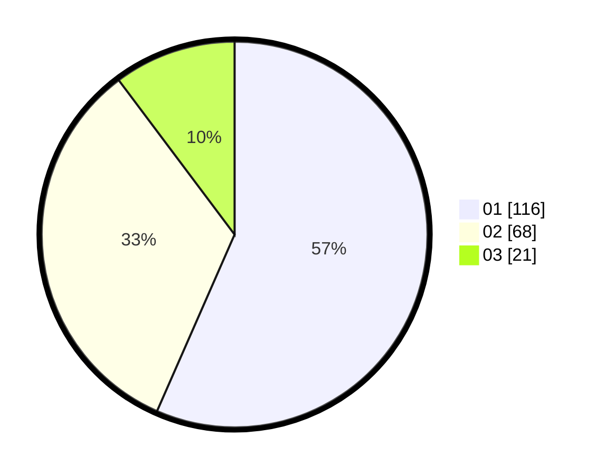

# Hasil

Hasil perolehan suara paslon dapat dilihat pada file paslon-01.txt, paslon-02.txt, dan paslon-03.txt.

Jika tidak ada, artinya data tersebut belum ada pada SIREKAP.

## Perolehan Suara

 * Paslon 01: **116**.
 * Paslon 02: **68**.
 * Paslon 03: **21**.

## Foto C Plano

https://sirekap-obj-formc.kpu.go.id/7a87/pemilu/ppwp/31/75/03/10/07/3175031007095-20240214-220931--07ab633c-6a58-430c-af91-66d9c1600798.jpg

https://sirekap-obj-formc.kpu.go.id/7a87/pemilu/ppwp/31/75/03/10/07/3175031007095-20240215-004535--61b8532c-d40f-45b2-97af-18085ecf17a2.jpg

https://sirekap-obj-formc.kpu.go.id/7a87/pemilu/ppwp/31/75/03/10/07/3175031007095-20240215-004544--bcb209f6-81a4-4342-8ff9-3e94720ea9ba.jpg
